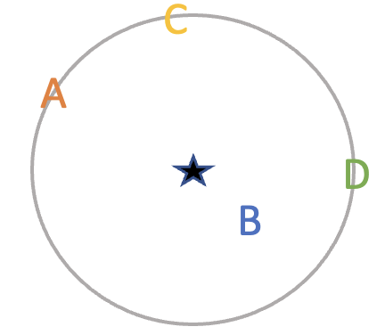

```{r setup, include=FALSE, message = FALSE, warning = FALSE, echo = FALSE}
knitr::opts_chunk$set(echo = F)
library(tidyverse)
```

**Please show your work for all exercises where you are asked to calculate something.**

## Introduction

For the $K$-Nearest Neighbors (KNN) classifier, after choosing $K$ we need to somehow find the nearest neighbors. That is, for a new point $x_{0}$, we need to determine the neighboring set $\mathcal{N}_{0}$. Here, "nearest" gives off a notion of closeness or distance. Therefore, we want to somehow measure distance between features/predictors. How might we do that?

### Euclidean distance

In Mathematics, the Euclidean distance is defined as the shortest possible path through space between two points.

On a number line (one-dimension), the distance between two points $a$ and $b$ is simply the absolute value of their difference: letting $d(a,b)$ denote the Euclidean distance between points $a$ and $b$, $d(a,b) = |a-b|$. This is equivalent to $d(a,b) = \sqrt{(a-b)^2}$


In two-dimensions (think $x$ - $y$ coordinate system, latitude-longitude), the two points are $\mathbf{a} = (a_{1}, a_{2})$ and $\mathbf{b} = (b_{1}, b_{2})$. The euclidean distance between points  $\mathbf{a}$ and  $\mathbf{b}$ is given by $$d(\mathbf{a}, \mathbf{b}) = \sqrt{(a_{1} - b_{1})^2 + (a_{2} - b_{2})^2}$$ Importantly, "two-dimensions" refers to the number of coordinates in each point; not the fact that we are calculating a distance between two points.

This easily generalizes to $p$-dimensions! If our two points are $p$-dimensional (i.e. $\mathbf{a} = (a_{1}, a_{2}, \ldots, a_{p})$ and $\mathbf{b} = (b_{1}, b_{2}, \ldots, b_{p})$), then 
$$d(\mathbf{a}, \mathbf{b}) = \sqrt{(a_{1} - b_{1})^2 + (a_{2} - b_{2})^2 + \ldots + (a_{p} - b_{p})^2 } = \sqrt{\sum_{j=1}^{p}(a_{j} - b_{j})^2}$$


For example: let $\mathbf{a}= (1,2)$ and $\mathbf{b} = (3,5)$. Then the Euclidean distance between them is $d(\mathbf{a}, \mathbf{b}) = \sqrt{(3-1)^2 + (5-2)^2} = \sqrt{13}$.


### Manhattan distance

Another possible way to define distance is using the Manhattan distance. This is named after the grid-system of Manhattan's roads. An analogy is the number of blocks (in the north, south, east or west directions) a taxicab must travel on, in order to reach its destination on the grid of streets in parts of New York City.

The Manhattan distance $d_{m}$ between two $p$-dimensional points $\mathbf{a}$ and  $\mathbf{b}$ is defined as 

$$d_{m}(\mathbf{a}, \mathbf{b}) = \sum_{j=1}^{p}|a_{j} - b_{j}|$$


### Distances for categorical features

Thus far, we have assumed that all our predictors are quantitative, but oftentimes we have qualitative features. How does one measure the distance between categorical levels?

One approach is to assign numeric values for each possible category. For example, if the feature is "Experience level" with levels (Beginner, Average, Professional), maybe we assign the values (0, 5, 10). However, this assumes an implicit ordering in the levels.

Alternatively, consider that all our $p$ features are binary in that they each take one of two values. Example: $X_{1}$ = smoker status (non-smoker/smoker) and $X_{2}$ = drinks alcohol (no/yes). The Hamming distance is the number (or proportion, depending on the context) of features for which the two values do not match.


### Exercise 1

```{r echo = F}
n <- 6
```

Suppose we have `r n` training data points as follows:

```{r echo = F}
obs <- 1:n
x1 <- c(0, 1, 1, 2, -1, 0)
x2 <- c(3, -1, 1, 0, 1, 1)
x3 <- c(1, 2, -1, 0, 0, 0)
y <- c("red", "red", "blue", "red", "blue", "red")
df1 <- data.frame(X1 = x1, X2 = x2, X3 = x3, Y = y)
knitr::kable(df1)
```

Suppose we want to use this data set to make a prediction for Y when (X1, X2, X3) = (0,0,0) using KNN.


a) Compute the Euclidean distance between each observation and the test point.

b) Using the Euclidean distance metric, what is our prediction with $K = 1$? Why?

c) Using the Euclidean distance metric, what is our prediction with $K = 3$? Why?

d) Compute the Manhattan distance between each observation and the test point.

e) Using the Manhattan distance metric, what is our prediction with $K = 1$? Why?

f) Using the Manhattan distance metric, what is our prediction with $K = 3$? Why?

g) Can you think of certain scenarios where we might prefer one distance metric over another? 


### Exercise 2

Suppose we have `r n` training data points as follows
 
```{r echo = F}
x1 <- c("smoker", "non-smoker", "smoker", "smoker", "smoker","non-smoker")
x2 <- c("yes", "no", "no", "yes", "yes", "no")
x3 <- c("no", "yes", "no", "yes", "no", "yes")
df2 <- data.frame("Smoke status" = x1, "Alcohol" = x2, "Athlete" = x3)
knitr::kable(df2)
```

a) Calculate the Hamming distances between a new test point where the individual does not smoke, does not consume alcohol, and does not play a sport.
Please "show"/explain your work.


b) Hamming distance is commonly used to measure distance between words or phrases. What is the Hamming distance between the words "MIDDLEBURY" and "SWARTHMORE"?

c) For points with $p$ features, are the minimum and maximum possible Hamming distances?

### Exercise 3

Suppose we are still in the classification setting, but we have 4 different classes: $\{A, B, C, D\}$. We wish to classify the starred observation using the KNN classification method with $K = 2$. After calculating distances, we have 4 nearest neighbors:

```{r echo = F, fig.align="center", out.width="20%"}

```

#### Part 1 (a-c)

Unfortunately, besides one obvious neighbor belonging to class $B$, the three other points are equidistant to our unclassified star observation. How do we solve this?

Option 1: *choose a different* K. 

Option 2: *randomly choose between the tied neighbors*. 

Option 3: *allow at least* K *neighbors until a natural stopping point*. In this example, the idea is to choose the smallest number such that $K$ is greater than or equal to 2, and that no ties exist.

a) What are some issues with Option 1?

b) If we go with Option 2, what are the possible $K$-neighbor sets? Do you see any issues with this approach? If so, explain.

c) If we go with Option 3, what is our resulting neighbor set? Do you see any issues with this approach? If so, explain.

#### Part 2 (d-e)

d) Suppose we go with Option 3 to choose our neighbors. Now we need to classify the starred point. However, what issue arises if we apply the usual "majority vote" rule?

e) Suggest two methods for addressing the concern in (d). For each suggestion, describe what you would classify the starred point as. Of your suggestions, which would you prefer and why?

f) Although the issues in Part 1 and Part 2 are similar, clearly state the differences between the two.


### Exercise 4

In class, we introduced the notion of mean squared error (MSE):

$$\text{MSE}=\frac{1}{n}\sum_{i=1}^{n}(y_{i}-\hat{y}_{i})^2$$ 
where $y_{i}$ is the true value, and $\hat{y}_{i}$ is the predicted value. We can use MSE to compare different models' quality of predictions. 

Another metric that is commonly used is the mean absolute error (MAE), which simply uses the absolute value of the difference, rather than the squared difference:

$$\text{MAE}=\frac{1}{n}\sum_{i=1}^{n}|y_{i}-\hat{y}_{i}|$$ 

In the following table, the first column `y_true` denotes the true values $y_{i}$. The second column `yhat1` holds the predicted values obtained from a model $\mathcal{M}_{1}$, and the third column `yhat2` holds the predicted values obtained from a different model $\mathcal{M}_{2}$.

```{r echo = F}
y_true <- c(1, 3, 1, -1, 0, 5)
yhat1 <- c(0, 1, 0, 0, -1, 3)
yhat2 <- c(2, 3, 2, 2, 1, 4)
df3 <- data.frame(y_true = y_true, yhat1 = yhat1, yhat2 = yhat2)
knitr::kable(df3)
```

a) Calculate the MSE for both models. 


b) Calculate the MAE for both models. 


c) Based on your results in (a) and (b), which model performs better predictions?

d) What are the implications of your answer in (c)?

### Exercise 5

Now, let's consider some new data with just one model for predictions: 

```{r echo = F}
y_true <- c(1, 3, 1, -1, 0, 2)
ypred <- c(0, 2, 0, -3, -1, 1)
df4 <- data.frame(y_true = y_true, yhat = ypred)
knitr::kable(df4)
```

a) Calculate the MSE and MAE. 


b) Now, suppose we measure a 7th point, where $y_{7} = 5$ and $\hat{y}_{7} = 15$. Clearly our prediction is way off! Calculate the MSE and MAE including this new observation. Comment on how the new MSE and MAE compare to the errors obtained on the original six data points in part (a). 

c) Are there scenarios where we might prefer one error metric over the other? Explain.

### Exercise 6

For (a) and (b), explain whether each scenario is a classification or regression problem, and indicate whether we are most interested in inference or prediction. Also provide $n$ and $p$.

a) We are foraging for mushrooms and happen to find a mushroom we have never seen before. How exciting! We would like to determine if it is poisonous based on thirty mushrooms we have previously collected. For each of these thirty mushrooms, we know its color, shape, where it was found, spore dispersal method, and poison status. *While statistical learning methods are powerful, please do not trust them to rely on identifying poisonous mushrooms!*

b) We collect data on 300 national universities, recording the average school expenditures per student, average SAT scores, tuition cost, and average family income. We would like to understand what factors might influence the average salary of alumni from these universities.

c) What are some other variables/features that may be useful for the problem described in (b)?

### Exercise 7

For each of the following, indicate whether we would generally expect the performance of a flexible statistical learning methods to be better or worse than an inflexible method. Justify your answer.

a) The relationship between the predictors and response is highly complex.

b) The variance of the errors terms ($\sigma^2 = \text{Var}(\epsilon)$) is extremely high.

c) The number of predictors $p$ is extremely large relative to the number of observations $n$.

d) You are confident in your assumptions about the underlying function.


## Submission 

Please upload your finished assignment to Canvas as a PDF (either scanned or converted document). 