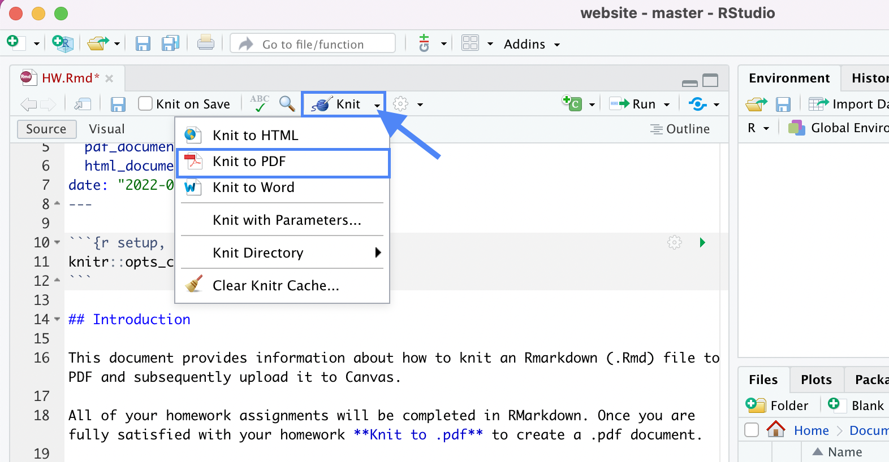

```{r setup, include=FALSE}
knitr::opts_chunk$set(echo = F, fig.align = "center")
```

## Introduction

This document provides information about how to knit an Rmarkdown (.Rmd) file to PDF and subsequently upload it to Canvas.

### Knitting to PDF

All of your lab assignments (and some of your homework) will be completed in RMarkdown as .Rmd files. It is good practice to periodically **Knit to PDF** to create a .pdf document, as the final version will be submitted as a PDF document.

```{r}

```

A PDF version of your assignment should generate. You may get a pop-up window asking if it's okay to open it. If so, "accept". 

### Upload to Canvas

Once you are fully satisfied with your homework and are ready to submit, knit to PDF once more. Navigate to your Math218 folder on your Desktop and find the .pdf file associated with the assignment. Upload this PDF file to the corresponding Assignment on Canvas.


