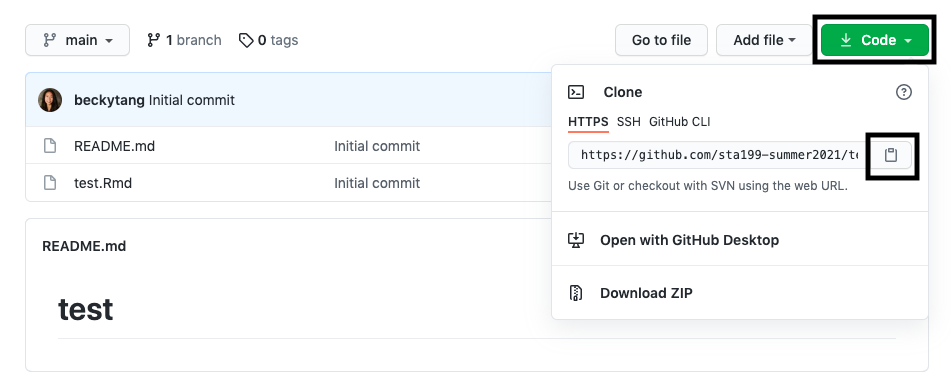
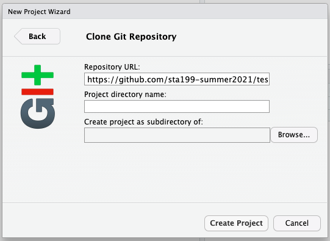

## Git and GitHub

We will be working with Git and GitHub as our version control system.

### Concepts introduced:
 
- Clone a GitHub repo and make a new RStudio project 
- Configure Git
- Working with a local and remote repository
- Making a change locally, committing, and pushing
- Making a change on GitHub and pulling

### Getting started

- Go to the course GitHub organization: https://github.com/math218-fall2022. 

- If you see a pending invite at the top of the page, accept the invite to join the course invite.

#### Clone a GitHub repo and make a new RStudio project 

- Go to the [course organization](https://github.com/math218-fall2022) on GitHub  and find the repo with the prefix **lab-01-review-**. 

- Click on the green **Clone or download** button, select **Use HTTPS** (this might already be selected by default, and if it is, you'll see the text **Clone with HTTPS** as in the image below). Click on the clipboard icon to copy the repo URL.

```{r clone-repo-link, echo = FALSE, fig.width = 5}

```

- Open up RStudio

- Go to *File* $\rightarrow$ *New Project* $\rightarrow$ *Version Control* $\rightarrow$ *Git*. 

```{r paste-gh-repo-url, echo = FALSE,  out.width = "80%"}

```

- Copy and paste the URL of your assignment repo into the dialog box *Repository URL*. You can leave *Project Directory Name* empty. It will default to the name of the GitHub repo. In *Create project as a subdirectory of*, hit "Browse" and find your Math218 folder.

- Click *Create Project*, and the files from your GitHub repo will be displayed the *Files* pane in RStudio. 


#### Configure Git

- We will need to allow RStudio to communicate with Github. We will do this by utilizing the `usethis` package. Install the package by typing the following in your **Console**:

```{r eval = F}
install.packages("usethis")
```

  - You will see some red text flying across the Console. If you eventually see some black text beginning with "The downloaded binary packages are in...", then you are good!

- Next, load the package by typing the following in your Console:

```{r eval  = F}
library(usethis)
```

- Configure git by running the following code in the Console. Fill in your GitHub username and the email address associated with your GitHub account. **Note**: you must keep the quotation marks!

```{marginfigure}
The email address is the one tied to your GitHub account. 
```

```{r eval  = F}
use_git_config(user.name = "GitHub username", user.email="your email")
```

For example, mine would be 

```{r eval=FALSE}
library(usethis)
use_git_config(user.name="beckytang", user.email="btang@middlebury.edu")
```


Once you run the configuration code, your values for `user.name` and `user.email` will display in the console. If your `user.name` and `user.email` are correct, you're good to go! Otherwise, run the code again with the necessary changes.

**Note**: if you close RStudio and then return to a project at a later date, you may need to re-configure Git. When this happens, simply load the library `usethis` and run the `use_git_config()` function again! Later, we will change this so you only have to enter the your information once per project.


#### Making a change locally, committing, and pushing

- Open the RMarkdown file **lab-01-review.Rmd**. We will use that for the next part of class. 

- Put your name for the author, then knit the document. 

- Select/check **all** of the updated files in the Git pane, click the "Commit" button, and write the commit message "Updated author name". 

- Click to **push** your changes (you may have to enter your GitHub password).

- If you refresh your repo on GitHub, you will see the updated files with your commit message. 

#### Making a change on GitHub and pulling

- On the corresponding repository in GitHub, find the README.md file at the bottom. Edit this file by clicking on the pencil and typing your name + major + year. 

- Once you're finished editing, hit the green "Commit changes" button.

- Back in RStudio, navigate to the Git tab and **pull** the changes by hitting the down arrow. A small window should pop up with some text.

- Find and open the README.md file in the Files pane. You should see your changes here locally!
