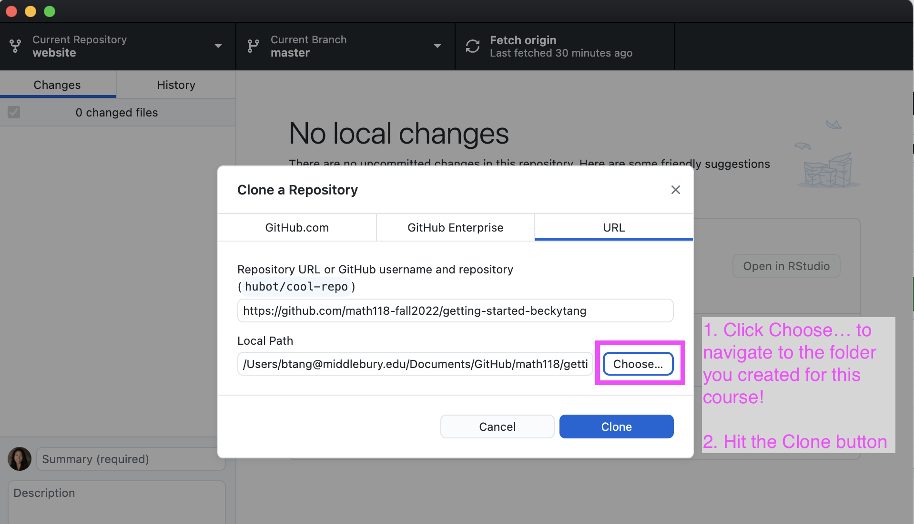

```{r setup, include=FALSE}
knitr::opts_chunk$set(echo = F, fig.align = "center", out.width = "50%")
```

We will be working with Git and GitHub as our version control system.

### Concepts introduced:
 
- Clone a GitHub repo and make a new RStudio project 
- Configure Git
- Working with a local and remote repository
- Making a change locally, committing, and pushing
- Making a change on GitHub and pulling

### Download GitHub Desktop

- Go to the GitHub Desktop website: https://desktop.github.com/

- Click the purple button that says "Download for..."

  - A zipped file will eventually appear in your Downloads folder. Open up your Downloads folder.
  
- After unzipping the folder, you should see the purple GitHub Desktop icon. I suggest dragging this to your Dock. 

```{r}

```


- Open GitHub Desktop. At some point, you might get the following pop-up:

```{r}

```


  - Check the "Do not show this message again", and choose the white "Not now" button.
  
  
### Login from GitHub Desktop
  
- Once GitHub Desktop is open, we should login with your new account

  - Mac users: Next to the Apple icon, click GitHub Desktop -> Preferences -> Accounts -> Sign-in
  
```{r}

```
  
  - Windows users: Next to the app icon, click File -> Options -> Accounts -> Sign-in
  
```{r}

```

- You will be direct to the github.com broswer to sign-in. Enter your corresponding GitHub account information.

- Once authenticated, your GitHub Desktop client should be set up!

### Clone a GitHub repo and make a new RStudio project

- Go to the [course organization](https://github.com/math118-fall2022) on GitHub  and find the repo with the prefix **lab-01-review**. 

- Click on the green **Code** button, select the second option "Open with GitHub Desktop"

```{r}
knitr::include_graphics("img/00-git/clone.png")
```

- The GitHub Desktop application will open up, with a white window that says "Clone a Repository". **Important**: in the second line that says "Local Path", there is a button that says `Choose...`. Click on it, and find and select the folder we created for this course. Then hit the blue `Clone` button.

```{r}

```

- After successfully cloning, the window will disappear and you will see the that Current Repository is the one you just cloned.

- Success!

### Making a change locally, committing, and pushing

- Open the RMarkdown file **lab-01-review.Rmd** in RStudio. We will use that for the next part of lab. 

- Put your name for the author, then knit the document. *It's important to knit the document, as this saves your progress!*

- Open GitHub Desktop. On the left, you should see the names of files you changed or created. That's good! That means that your version locally is different than the previous version.

- On the left hand side next to your photo/graphic, type a *brief* comment such as "Update author name". Push the blue `Commit to main` button. After that, the third tab at the top that says `Push origin` should have an upward arrow with a number next to it. That means you are ready to send your changes to GitHub. Click `Push origin`, and you should see that it successfully completes the action.

```{r}
knitr::include_graphics("img/00-git/commit_push.png")
```

  - *Note*: sometimes, the push doesn't execute properly and the application "hangs" (i.e. doesn't complete and says it is still in progress). In this event, quit out of GitHub Desktop. Then re-open it. Your commit message should still be there. Try pushing again.

- If you refresh your repo on GitHub, you will see the updated files with your commit message. 


### Making a change on GitHub and pulling

- On the corresponding repository in GitHub, find the README.md file at the bottom. Edit this file by clicking on the pencil and typing your name + major + year. 

- Once you're finished editing, hit the green "Commit changes" button.

- Back in GitHub Desktop, find the `Fetch origin` tab. Since your local version is not up to date, you should **pull** the changes by hitting the button. 

- Find and open the README.md file in the Files pane of RStudio. You should see your changes here locally!

