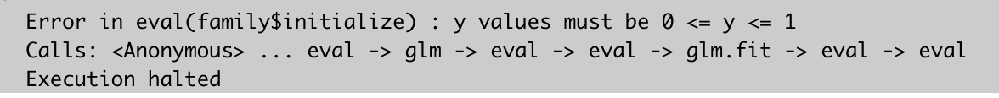

# Data and Packages

```{marginfigure}
You probably need to install the `e1071` and `class` libraries.
```

```{r message = F, warning = F}
library(tidyverse)
library(MASS)
library(e1071)
library(class)
```

The file bmd.csv contains 169 records of bone densitometries (measurement of bone mineral density). The following variables were collected:

- `id` – patient’s number
- `age` – patient’s age
- `fracture` – hip fracture (fracture / no fracture)
- `weight_kg` – weight measured in Kg
- `height_cm` – height measure in cm
- `waiting_time` – time the patient had to wait for the densitometry (in minutes)
- `bmd` – bone mineral density measure in the hip

Our goal is predict whether someone had a hip `fracture` or `no fracture`.

```{r}
bmd_dat <- read.csv("data/bmd.csv", header = T)
names(bmd_dat)
str(bmd_dat)
```

# Logistic Regression

We being by fitting a logistic regression model to predict `fracture` using the  bone mineral density `bmd`. The `glm()` function can be used to fit a range of generalized linear models, including logistic regression. The syntax of `glm()` is almost identical to that of `lm()`, but we pass in the argument `family = "binomial"` in order to tell `R` to run a logistic regression rather than some other type of generalized linear model


```{r eval = F}
glm_mod <- glm(fracture ~ bmd, data = bmd, family = "binomial")
```

However, if we were to run the above code, we would get the following error message:

```{r fig.align="center", echo = F}

```


This is because the type of variable that `fracture` is in the dataset is a character, when `R` is expecting it to be a factor or 0/1 variable. Let's remedy that here.

```{marginfigure}
Here, I use the `factor()` function to create a factor variable, and the `levels` argument specifies the order. In particular, "no fracture" is the 0 case, and "fracture" is the 1 case. I am saving it as a new variable called `status`.
```

```{r}
bmd_dat <- bmd_dat %>%
  mutate(status = factor(fracture, levels = c("no fracture", "fracture")))
glm_mod <- glm(status ~ bmd, data = bmd_dat, family = "binomial")
summary(glm_mod)
```

Just like with `lm()`, we can use the `coef()` function to obtain the estimated coefficients:

```{r}
coef(glm_mod)
```

The `predict()` function can be used to predict the probability that the market will go up, given values of the predictors. The `type = "response"` option tells `R` to output probabilities of the form `P(Y = 1|X)`, as opposed to other information such as the logit. 
If no new data are passed into the function, then the probabilities for the training data are computed.

```{r}
glm_probs <- predict(glm_mod, type = "response")
glm_probs[1:8]
```

If we want to obtain the predicted probability of `fracture` for someone with `bmd` = 0.75:

```{r}
predict(glm_mod, type = "response", newdata = data.frame(bmd = 0.75))
```

In any event, we need to convert these probabilities of `fracture` given `bmd` into actual classifications of `fracture` or `no fracture`. The following two commands create a vector of class predictions based on whether the predicted probability of a fracture is greater than or less than 0.5. 

```{marginfigure}
Can you explain what each command is doing?
```

```{r}
glm_pred <- rep("no fracture", nrow(bmd_dat))
glm_pred[glm_probs >= 0.5] <- "fracture"
```

Given these predictions, the `table()` function can be used to produce a confusion matrix in order to determine how many observations were correctly or incorrectly classified.

```{r}
glm_pred <- factor(glm_pred, levels = c("no fracture", "fracture") )
table(glm_pred, truth = bmd_dat$status)
```

The diagonal elements of the confusion matrix indicate correct predictions, while the off-diagonals represent incorrect predictions. Our model correctly predicted 110 patients with no fractures and 34 with a fracture. We can compute the fraction of days for which the prediction was correct:


```{r}
mean(glm_pred == bmd_dat$status)
```

We can add other predictors into the logistic regression model:

```{r}
glm_mod2 <- glm(status ~ age + sex + bmd, data = bmd_dat, family = "binomial")
summary(glm_mod2)
```

It seems like after adjusting for `bmd`, the other predictors are not very helpful in explaining whether or not someone has a `fracture`. However, it seems like adding these predictors variables helps us better classify patients with fractures:

```{r}
glm_probs2 <- predict(glm_mod2, type = "response")
glm_pred2 <- rep("no fracture", nrow(bmd_dat))
glm_pred2[glm_probs2 >= 0.5] <- "fracture"

glm_pred2 <- factor(glm_pred2, levels = c("no fracture", "fracture") )
table(glm_pred2, truth = bmd_dat$status)
```

# Linear Discriminant Analysis

We will now perform LDA on the `bmd` data. Let's again try and predict `status` using `bmd`. 
In `R`, we fit an LDA model using the `lda()` function, which is part of the MASS library. Notice that the syntax for the `lda()` function is identical to that of `lm()`, and to that of `glm()` except for the absence of the family option.

```{r}
lda_mod <- lda(fracture ~ bmd, data = bmd_dat)
lda_mod
```

Notice that the LDA output indicates that $\hat{\pi}_{\color{blue}{\text{no fracture}}} =$ `r lda_mod$prior[1]` and  $\hat{\pi}_{\color{blue}{\text{fracture}}} =$ `r lda_mod$prior[2]`.  It also provides the group means; these are the average of each predictor within each class, and are used by LDA as estimates of the $\mu_{k}$.

We can once again use the `predict()` function to obtain predictions for a given value of `bmd`. This function returns a list with three elements, the first of which is `class`.  This element contains LDA’s predictions about the `status`. This case, LDA preditions `fracture`.

```{r}
predict(lda_mod, newdata=data.frame(bmd=0.50))$class
```

As discussed in lecture, LDA and logistic regressions yield very similar predictions. In this case, they are identical:

```{marginfigure}
Note: the `predict()` function also returns an element called `posterior`. This is a matrix whose $k$-th column holds the posterior probability that the corresponding observation belongs to the $k$-th class (see slides). This is used to classify.
```

```{r}
lda_preds <- predict(lda_mod, bmd_dat)
mean(lda_preds$class == glm_pred)
mean(lda_preds$class == bmd_dat$status)
```

# Quadratic Discriminant Analysis

We will now fit a QDA model to the same data. QDA is implemented in `R` using the `qda()` function, which is also part of the `MASS` library. The syntax is identical to that of `lda()`.

```{r}
qda_mod <- qda(fracture ~ bmd, bmd_dat)
qda_mod
```

The output once again contains the group means and prior probabilities for each group. The `predict()` function works in exactly the same fashion as for LDA.

```{r}
qda_preds <- predict(qda_mod, bmd_dat)
mean(qda_preds$class == bmd_dat$status)
```

Interestingly, QDA does slightly worse than than LDA (and logistic regression). This suggests that QDA does not  capture the true relationship more accurately than the linear forms assumed by LDA and logistic regression. It could also be the case that we do not have enough training data $n$.

# Naive Bayes

Naive Bayes is implemented in `R` using the `naiveBayes()` function, which is part of the `e1071` library. The syntax is identical to that of the previous two methods:


```{r}
nb_mod <- naiveBayes(fracture ~ bmd, data = bmd_dat)
nb_mod
```

The output contains the estimated mean and standard deviation for `bmd` in each class. For example, the mean `bmd` for those with `fracture` is `r round(nb_mod$tables$bmd[1,1], 3)`, and the standard deviation of `bmd` for this group is `r round(nb_mod$tables$bmd[1,2], 3)`.

```{marginfigure}
Note that `predict()` for a Naive Bayes model defaults to outputting the predicted class. If we wanted estimates of the probabilities, we would need to pass in the argument `type = "raw"` into the function as well.
```

The `predict()` function is straightforward. We see that Naive Bayes yields the same predictions as QDA for this data:

```{r}
nb_preds <- predict(nb_mod, bmd_dat)
mean(nb_preds == qda_preds$class)
```

# K-Nearest Neighbors Classification

We will now perform KNN using the `knn()` function, which is part of the `class` library. This function works rather differently from the other model-fitting functions that we have encountered thus far. Rather than a two-step approach in which we first fit the model and then we use the model to make predictions, `knn()` forms predictions using a single command. The function requires four inputs:

- A matrix or data frame containing the predictors associated with the training data, labeled `X_train` below.
- A matrix or data frame containing the predictors associated with the data for which we wish to make predictions, labeled `X_test` below.
- A vector containing the class labels for the training observations, labeled `class_train` below.
- A value for $k$, the number of nearest neighbors to be used by the classifier.

Also, remember that it is usually good practice to standardize the data so that all variables are given a mean of zero and a standard deviation of one. Then all variables will be on a comparable scale. The `scale()` function does just this. 

```{r}
bmd_dat_scale <- bmd_dat %>%
  mutate_if(is.numeric,scale)
```


Here, I will illustrate the `knn()` function to obtain predictions for the full set of data (i.e. we do not have a test set). I will predict `status` using the predictors `bmd` and `age` with $k = 3$.

We set a random seed before we apply `knn()` because if several observations are tied as nearest neighbors, then `R` will randomly break the tie. Therefore, a seed must be set in order to ensure reproducibility of results.

```{marginfigure}
What happens if you choose $k = 1$?
```

```{r}
set.seed(1)
knn_preds <- knn(train = bmd_dat_scale %>% dplyr::select(bmd,age),
                 test = bmd_dat_scale %>% dplyr::select(bmd,age),
                 cl = bmd_dat_scale$status, 
                 k = 3)
table(knn_preds, truth = bmd_dat_scale$status)
```

# YOUR TURN!

## Exercise 1
Here, we will hand-code the LDA method for the `bmd_dat` data we worked with above.  In particular, we will use LDA to predict `status` given `bmd`.

Recall that the discriminant function is given by:

$$\delta_{k}(\color{blue}{\text{bmd}}) = \color{blue}{\text{bmd}} \times \frac{\mu_{k}}{\sigma^2} - \frac{\mu_{k}^2}{2\sigma^2} + \log(\pi_{k})$$
where $\mu_{k}$ is the mean `bmd` for the group $k=$ `fracture` or $k=$ `no fracture`, $\sigma$ is the standard deviation for `bmd`, and $\pi_{k} = P(\color{blue}{\text{status}} = k)$ is the marginal probability of each category.


a) Obtain estimates for the mean parameters $\mu_{k}$. Store these as values `mu_frac` and `mu2_nofrac`.

b) Obtain an estimate for the standard deviation of `bmd`. Store this as a value called `s_bmd`. Note, this is *not* as simple as using the function `sd()`. Refer back to the slides for the form!

c) Obtain prior probabilities for each class. Store these as values `p_frac` and `p_nofrac`.

By this point, you have done all the hard work!

d) Now, obtain the discriminant scores for each group when `bmd` = 0.50. That is, calculate $\delta_{k}(\color{blue}{\text{bmd}} =0.5)$ for each group $k$.

e) Based on your answer in (d), would you predict that someone with a `bmd` of 0.50 has a `fracture` or `no fracture`, and why?

## Exercise 2
Write a function called `myLDA` that takes as input the following: a real-valued `x`, $K$-length vectors `mu` and `pi`, and a real_valued `sd`. Here, `x` represents that value of the predictor. `mu` and `pi` hold the mean of the predictor and marginal probabilities for each class $k$. `sd` is the standard deviation for LDA. The function should return a $K$-length vector of discriminant scores.

You can (and should) check to see if your function is working probably by passing in the the value 0.50 for `x` and confirm that your output matches your answer in 1(d).

The following code should help you get started by replacing the underlines with your own code. Remember to set `eval = T` when you knit.

```{r eval = F}
myLDA <- function(___, ____, ____, ____){
  K <- length(___)
  scores <- rep(NA, K)
  for(k in 1:K){
    scores[k] <- ________
  }
  return(scores)
}
```


## Exercise 3
Here, we will work with the dataset `bdiag.csv`, which includes several imaging details from patients that had a biopsy to test for breast cancer. The variable `diagnosis` classifies the biopsied tissue as `M` = malignant or `B` = benign. In addition, ten real-valued features are computed for each cell nucleus:

- `radius` (mean of distances from center to points on the perimeter)
- `texture` (standard deviation of gray-scale values)
- `perimeter`
- `area`
- `smoothness` (local variation in radius lengths)
- `compactness` (perimeter^2 / area - 1.0)
- `concavity` (severity of concave portions of the contour)
- `concave points` (number of concave portions of the contour)
- `symmetry`
- `fractal dimension` (“coastline approximation” - 1)

```{r}
bdiag_dat <- read.csv("data/bdiag.csv", stringsAsFactors = T, header = T)
```

a) Plot the distribution of the predictors. Describe what you see.

b) What proportion of patients in the dataset had a malignant biopsy?


c) Perform a logistic regression on the full data using `texture`, `smoothness`,  and `symmetry`. Use the summary function to print the results. Do any of the predictors appear to be statistically significant? If so, which ones?

d) From your fitted model in (c), compute the confusion matrix and overall fraction of correct predictions. Explain what the confusion matrix is telling you about the types of mistakes made by logistic regression.


Now split the data into a train set and a test set using the following code. Remember to set `eval = T` before you knit.

```{r eval = F}
set.seed(5)
train_ids <- sample(1:nrow(bdiag_dat), 0.5 * nrow(bdiag_dat))
test_ids <- (1:nrow(bdiag_dat))[-train_ids]
```

e) Fit a logistic regression model *on the training data* using the same predictors. Then compute the confusion matrix and overall fraction of correct predictions *for the test data*. 


f) Repeat (e) using LDA.


g) Repeat (e) using QDA


h) Repeat (e) using naive Bayes.


i) Repeat (e) using KNN with $K = 1$. First, make another dataset called `bdiag_dat_scale` which centers and scales the predictors.


j) Repeat (e) using KNN with $K = 15$


k) Which of these methods appears to provide the best results on this data?

# Submission

Once you are finished with this lab, knit one last time, commit your changes, and push to GitHub. Then submit the PDF to Canvas.

Data courtesy of Biostatistics Collaboration of Australia.
