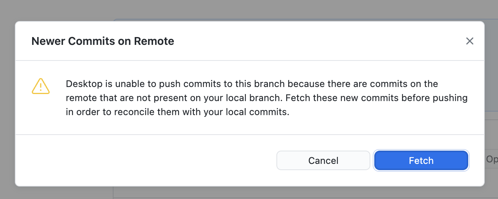
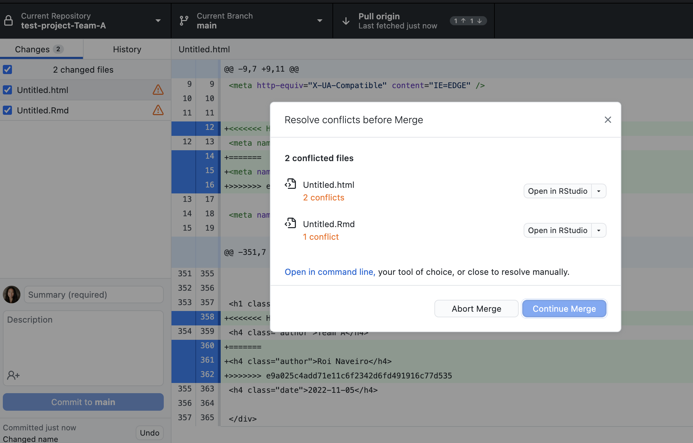
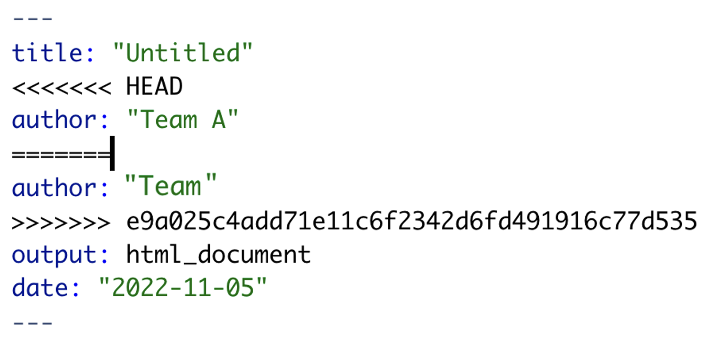
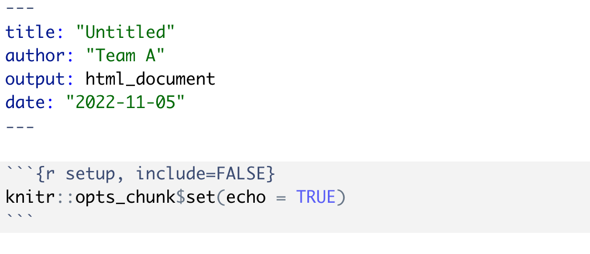
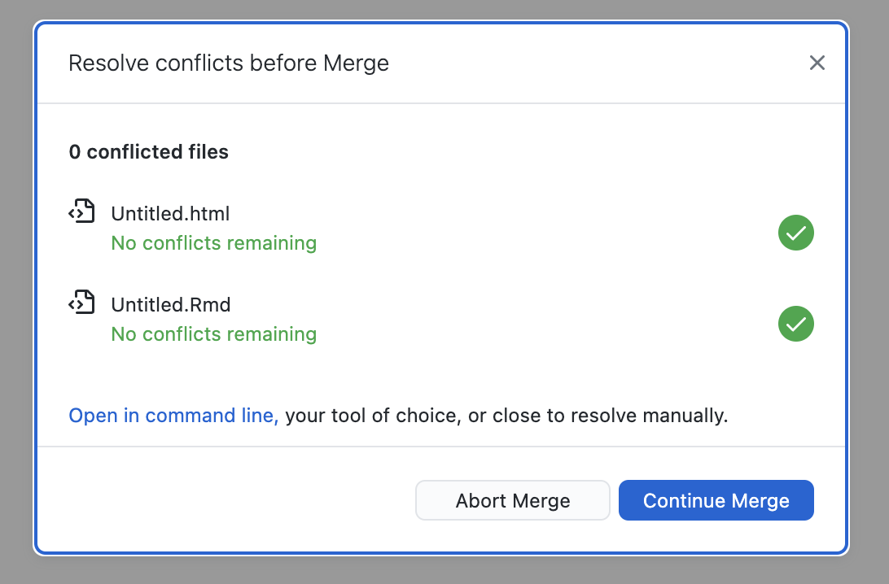
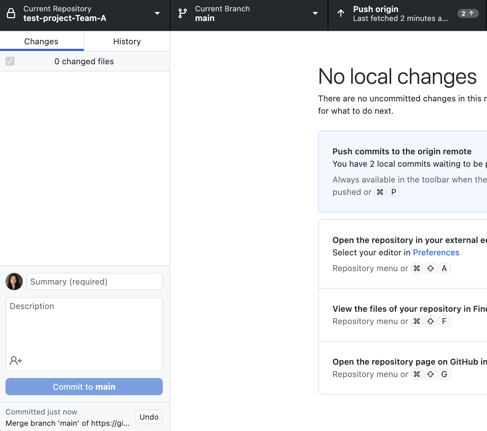
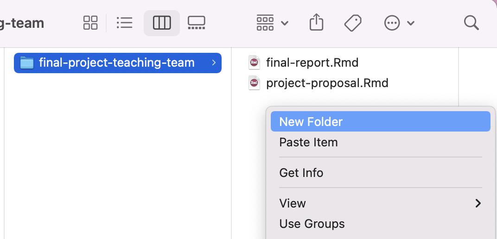
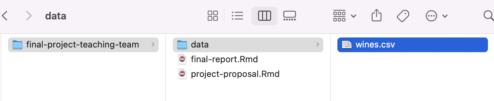

```{r setup, include=FALSE}
# R options
options(
  htmltools.dir.version = FALSE, # for blogdown
  show.signif.stars = FALSE,     # for regression output
  warm = 1
  )
# Set dpi and height for images
library(knitr)
opts_chunk$set(fig.height = 2.65, dpi = 300) 
# ggplot2 color palette with gray
color_palette <- list(gray = "#999999", 
                      salmon = "#E69F00", 
                      lightblue = "#56B4E9", 
                      green = "#009E73", 
                      yellow = "#F0E442", 
                      darkblue = "#0072B2", 
                      red = "#D55E00", 
                      purple = "#CC79A7")

```

```{r echo=FALSE, message=FALSE, warning=FALSE}
library(tidyverse)
library(rvest)
```

## Agenda

1. What are merge conflicts?
2. Practice dealing with merge conflicts
3. Project proposal details
4. Practice adding data
5. Work!


---

class: middle, center

## Merge Conflicts
 
---

## Pulling

- Thus far, we have only *pushed* our local changes back to GitHub 

- However, if two or more people are working on the same project, you need some way to obtain the changes that others have made and update your version accordingly

  - We do this by **pulling** changes from GitHub

---

### What are merge conflicts?

When two collaborators make changes to a file and push the file to their repo, 
git merges these two files.

```{r echo=FALSE, out.width=300, fig.align="center"}
knitr::include_graphics("img/merge-conflicts/merge-no-conflict.png")
```

If these two files have conflicting content on the same line, git will produce a <font class="vocab">merge conflict</font>.

```{r echo=FALSE, out.width=300, fig.align="center"}
knitr::include_graphics("img/merge-conflicts/merge-conflict.png")
```


---

## Resolving merge conflicts

- Merge conflicts need to be resolved manually, as they require a human intervention

```{r echo=FALSE, out.width=800, fig.align="center"}
knitr::include_graphics("img/merge-conflicts/merge-conflict-identifiers.png")
```

- To resolve the merge conflict
  - decide if you want to keep only your text or the text on GitHub or 
  incorporate changes from both texts
  - delete the conflict markers `<<<<<<<`, `=======`, `>>>>>>>` and make the 
  changes you want in the final merge

---

class: center, middle

## Merge conflict activity

.question[Create a team name!]

---

### Practice dealing with merge conflicts

- Clone the repo starting with **final-project-** that has your new team name.
Open the `project-proposal.Rmd` R Markdown file.

- Assign the numbers 1 and 2 to each of the team members.
    - If you have 3 team members, assign numbers 1 - 3.

- Follow along as we complete each step of the exercise instructions.

-  Raise your hand if you have any questions during the exercise. 


---

```{r echo=FALSE, out.width=800, fig.align="center"}

```

---

```{r echo=FALSE, out.width=800, fig.align="center"}

```

---

```{r echo=FALSE, out.width=800, fig.align="center"}

```

---

```{r echo=FALSE, out.width=800, fig.align="center"}

```

---

```{r echo=FALSE, out.width=800, fig.align="center"}

```

---

```{r echo=FALSE, out.width=800, fig.align="center"}

```

---

```{r echo=FALSE, out.width=800, fig.align="center"}

```

---

## Tips for collaborating via GitHub

- Always **pull** first before you start working.

- Knit, commit, and push often to minimize merge conflicts and/or to make merge conflicts easier to resolve.

- Communicate with your partner when you are working on a given file

- If you find yourself in a situation that is difficult to resolve, ask questions ASAP, don't let it linger and get bigger.

---

class: middle, center

# Project proposal details


---

## Requirements

- Pick a dataset and come up with at least two research questions, motivated by some EDA

  - Upload the selected dataset to your GitHub repository

- Must be completed in the `project-proposal.Rmd` file

  - The R markdown file has guidance in the structure of the project proposal

- Submit PDF of project proposal to Canvas by Sunday, 11/13 at 11:59pm


---

class: middle, center

# Practice adding data

---

## Adding data

.question[JUST ONE TEAM MEMBER SHOULD DO THIS]


- Go to Canvas $\Rightarrow$ Files and download the file called `wines.csv`. Locate this file on your local computer, usually found in your `Downloads` folder.

- From your `Math 218` folder you created for this course, find the `final-project` project folder corresponding to your team's final project. Now create a new `data/` folder *within* this folder.

```{r data-folder, echo = FALSE, eval=TRUE, fig.width=5}

```

---

## Adding data (cont.)

- Within your new `data/` folder, upload the `wines.csv` file.  

```{r data-upload, echo = FALSE, eval=TRUE, fig.width=3}

```

--

- You may now load in the data with the following code as per usual. For example:

```{r eval=FALSE, echo = T}
library(tidyverse)
wines <- read.csv("data/wines.csv")
```

---

## Adding data (cont.)

.question[Once you have selected a dataset, simply delete the `wines.csv` file and add your new dataset.]

- If you encounter a type of file that you don't recognize and have trouble loading it in:

  - Try Google
  
  - Ask me!

