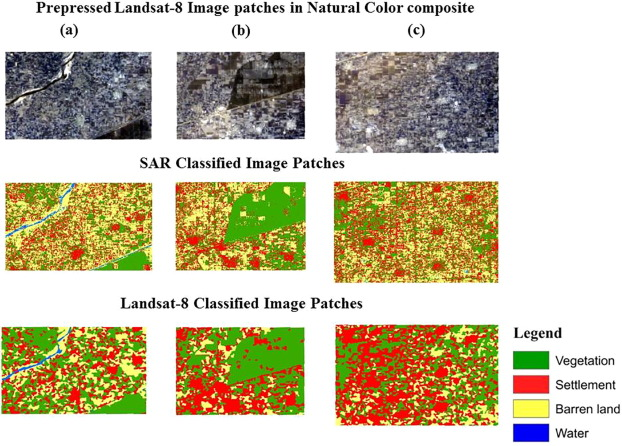

```{r packages, echo=FALSE, message=FALSE, warning=FALSE}
library(tidyverse)
library(NHANES)
knitr::opts_chunk$set(echo = F, warning = F, message = F)
```

class: center, middle

# Welcome!

---

## What is statistical learning?

- Learning (well) from data

---

```{r echo = F}
vars <- c("Age","AlcoholDay", "SmokeNow", "BMI", "BPDiaAve")
nhanes <- NHANES %>%
  dplyr::select(all_of(vars)) %>%
  na.omit() 
cols <- rep("blue", nrow(nhanes))
cols[which(nhanes$SmokeNow == "Yes")] <- "orange"
pairs(nhanes %>% dplyr::select(-SmokeNow), col = cols)

```

---

```{r fig.align="center",out.height = "70%",echo=FALSE}
library(ISLR)
attach(Wage) #Mid-Atlantic Wage Data
p1 <- Wage %>%
  ggplot(., aes(x = age , y = wage))+
  geom_point()+
  geom_smooth()+
  theme_classic()
p2 <- Wage %>%
  ggplot(., aes(x = education, y = wage, fill = education)) + 
  geom_boxplot()+
  theme_classic() +
  theme(axis.text.x = element_blank())
gridExtra::grid.arrange(p1,p2, nrow =1)
```

---

## Identify numbers 

```{r fig.align="center",out.width="70%",echo=FALSE}
knitr::include_graphics("figs/01-intro/mnist2.jpeg")
```

---

```{r fig.align="center",out.width="70%",echo=FALSE}

```
.footnote[
*Source: [A comparative study of ALOS-2 PALSAR and landsat-8 imagery for land cover classification using maximum likelihood classifier](https://www.sciencedirect.com/science/article/pii/S1110982317301205)
]
---

## Examples of statistical learning problems

- Classification
- Learning relationships
- Prediction

---

## Supervised Learning

- Notation: let $i = 1,\ldots, n$ index the observation
- For each observation $i$, we have:
  - Outcome/response: $y_{i}$
  - Vector of $p$ predictors/covariates: $\mathbf{x}_{i} = (x_{i1}, x_{i2}, \ldots, x_{ip})'$
- **Regression**: the $y_{i}$ are quantitative (e.g. height, price)
- **Classficiation**: the $y_{i}$ are categorical/qualitative (e.g. education level, diagnosis)
- Goal: relate response $y_{i}$ to the various predictors


---

## Objectives

1. Explanatory: understand which predictors affect the response, and how 
2. Prediction: accurately predict unobserved cases for new measurements of predictors
3. Assessment: quantify the quality of our predictions and inference

---

## Unsupervised Learning

- We only observe the $\mathbf{x}_{i}$, but no associated response $y_{i}$
- ''Unsupervised" because there is no response variable guiding the analysis!
- Objective may not be as clearly defined
- Difficult to assess how well your are doing

---

class: center, middle


# Git and GitHub

---

## Version control

- We will be using Git and GitHub for version control

---

## Versioning

```{r echo=FALSE, fig.align = "center", out.width = "80%"}
knitr::include_graphics("figs/01-intro/lego-steps.png")
```

---

## Versioning 

with human readable messages

```{r echo=FALSE, fig.align = "center", out.width = "80%"}
knitr::include_graphics("figs/01-intro/lego-steps-commit-messages.png")
```

---

### Why do we need version control?

```{r echo=FALSE, fig.align = "center", out.width="50%"}
knitr::include_graphics("figs/01-intro/phd_comics_vc.gif")
```

---

## Git and GitHub tips

- **Git** is a version control system -- like “Track Changes” features from Microsoft Word. 

--

- **GitHub** is the home for your Git-based projects on the internet (like DropBox but much better).

--

- There are a lot of Git commands and very few people know them all. 99% of the time you will use git to add, commit, push, and pull.

---

## Git and GitHub tips

- We will be doing git things and interfacing with GitHub through RStudio
    - If you Google for help you might come across methods for doing these things in the command line -- skip that and move on to the next resource unless you feel comfortable trying it out.

--

- There is a great resource for working with git and R: [happygitwithr.com](http://happygitwithr.com/).
    - Some of the content in there is beyond the scope of this course, but it's a good place to look for help.
    

---

## Before next class 

- Accept the invite to join `math218-fall2022` organization on GitHub TODAY!! 

- If you have not already done so "Getting to know you" survey on Canvas - due end of today today!
