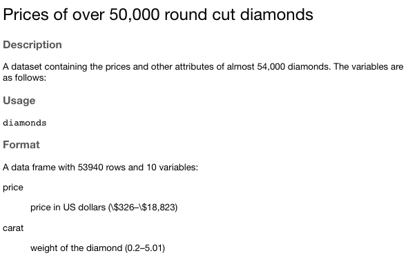
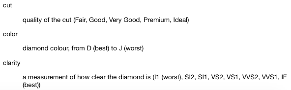

layout: true

<div class="my-footer">
<span>
<a href="http://datasciencebox.org" target="_blank">datasciencebox.org</a>
</span>
</div> 

---
```{r setup, include=FALSE}
# R options
options(
  htmltools.dir.version = FALSE, # for blogdown
  show.signif.stars = FALSE,     # for regression output
  warn = 1
  )
# figure height, width, dpi + warnings
knitr::opts_chunk$set(fig.height = 2.5,
                      fig.width = 5, 
                      dpi = 300,
                      warning = FALSE, 
                      message = FALSE) 
# fontawesome
htmltools::tagList(rmarkdown::html_dependency_font_awesome())
# magick
dev.off <- function(){
  invisible(grDevices::dev.off())
}
# code highlighting
hook_source <- knitr::knit_hooks$get('source')
knitr::knit_hooks$set(source = function(x, options) {
  x <- stringr::str_replace(x, "^[[:blank:]]?([^*].+?)[[:blank:]]*#<<[[:blank:]]*$", "*\\1")
  hook_source(x, options)
})
```

```{r packages, echo=FALSE, message=FALSE, warning=FALSE}
library(tidyverse)
# library(dsbox)
library(datasauRus)
library(DT)
library(Tmisc)
library(patchwork)
```


class: middle, center

# Identifying variables

---

## Number of variables involved

- .vocab[Univariate data analysis]: distribution of single variable

<br> 

- .vocab[Bivariate data analysis]: relationship between two variables

<br> 

- .vocab[Multivariate data analysis]: relationship between many variables at once, usually focusing on the relationship between two while conditioning for others

---

## Types of variables

- .vocab[Numerical variables] can be classified as .vocab[continuous] or .vocab[discrete] based on whether or not the variable can take on an infinite number of values or only non-negative whole numbers, respectively.
    - *height* is continuous
    - *number of siblings* is discrete

--

- If the variable is .vocab[categorical], we can determine if it is .vocab[ordinal] based on whether or not the levels have a natural ordering.
    - *hair color* is unordered 
    - *year in school* is ordinal

---

class: center, middle

# Visualizing numerical data

---

## Describing numerical distributions

- .vocab[shape:]
    - skewness: right-skewed, left-skewed, symmetric
    - modality: unimodal, bimodal, multimodal, uniform
    
- .vocab[center:] mean (`mean`), median (`median`), mode (not always useful)

- .vocab[spread:] range (`range`), standard deviation (`sd`), inter-quartile range (`IQR`)

- .vocab[outliers:] observations outside of the usual pattern

---

## Diamonds data 

```{r echo=FALSE}
diamonds <- diamonds %>%
  mutate(price_per_carat = price/carat)
```


```{r message=FALSE}
diamonds
```

---

## Diamonds data, glimpse

```{r message = F}
glimpse(diamonds)
```

---

## Diamonds help file
.pull-left[
```{r echo = F, out.width = "80%", fig.align = "center"}

```
]

.pull-right[
```{r echo = F, out.width = "80%", fig.align = "center"}

```
]

---

## Diamonds: clarity

```{r echo = F, out.width = "60%", fig.align = "center"}
knitr::include_graphics("img/03/diamond_clarity.png")
```

---

## Diamonds: color

```{r echo = F, out.width = "60%", fig.align = "center"}
knitr::include_graphics("img/03/diamond_colors.png")
```

---

## Histograms

.small[
```{r out.width = "80%", fig.align='center'}
ggplot(data = diamonds, mapping = aes(x = price)) +
  geom_histogram()
```
]

---

## Histograms

.pull-left[
```{r out.width = "80%", fig.align='center'}
ggplot(data = diamonds, mapping = aes(x = price)) +
  geom_histogram(binwidth = 1000)
```
]

.pull-right[
```{r out.width = "80%", fig.align='center'}
ggplot(data = diamonds, mapping = aes(x = price)) +
  geom_histogram(bins = 12)
```
]

---

## Density plots

.small[
```{r out.width = "80%", fig.align='center'}
ggplot(data = diamonds, mapping = aes(x = price)) +
  geom_density()
```
]

---

## Side-by-side box plots

.small[
```{r out.width = "80%", fig.align='center'}
ggplot(data = diamonds, mapping = aes(y = price, x = cut)) +
  geom_boxplot()
```
]

---

class: center, middle

# Visualizing categorical data

---

## Bar plots

.small[
```{r out.width = "80%", fig.align='center'}
ggplot(data = diamonds, mapping = aes(x = clarity)) + 
  geom_bar()
```
]

---

## Segmented bar plots, counts

.small[
```{r out.width = "70%", fig.align='center'}
ggplot(data = diamonds, mapping = aes(x = clarity, fill = cut)) + 
  geom_bar() 
```
]

---

## Segmented bar plots, proportions

.small[
```{r out.width = "70%", fig.align='center'}
ggplot(data = diamonds, mapping = aes(x = clarity, fill = cut)) + 
  geom_bar(position = "fill") + #<<
  labs(y = "proportion") 
```
]

---

## Which bar plot is more appropriate? 

.question[
Which plot is more useful for visualizing the relationship between clarity and cut? Why?
]


.pull-left[
```{r echo=FALSE, fig.align = "center"}
ggplot(data = diamonds, mapping = aes(x = clarity, fill = cut)) + 
  geom_bar()
```
]

.pull-right[
```{r echo=FALSE, fig.align = "center"}
ggplot(data = diamonds, mapping = aes(x = clarity, fill = cut)) + 
  geom_bar(position = "fill")+
  labs(y = "proportion") 
```
]
---

class: center, middle

# Data visualization

---

## What is data visualization?

Anything	that	converts	data	sources	into	a	visual	representation	

- charts
- plots
- maps
- tables
- etc.

.footnote[
Source: https://guides.library.duke.edu/datavis
]

---

class: center, middle

# Why do we visualize?

---

## Data: `datasaurus_dozen`

Below is an excerpt from the `datasaurus_dozen` dataset:

```{r datasaurus-view-wide,  echo=FALSE}
library(datasauRus)
datasaurus_dozen_wide %>%
  select(1:8)
```

---

## Summary statistics

```{r datasaurus-cor}
datasaurus_dozen %>%
  group_by(dataset) %>%
  summarise(r = cor(x, y))
```

---
.question[
How similar do the relationships between `x` and `y` look based on the plots? Based on the summary statistics? 
]

```{r datasaurus-plot, echo=FALSE, out.width = "80%", fig.align = "center"}
ggplot(datasaurus_dozen, aes(x = x, y = y, color = dataset))+
  geom_point()+
  facet_wrap(~ dataset, ncol = 5) +
  theme(legend.position = "none")
```

---

## Anscombe's quartet

```{r quartet-for-show, eval=FALSE}
library(Tmisc)
quartet
```

.pull-left[
```{r quartet-view1, echo=FALSE}
quartet[1:22,]
```
]
.pull-right[
```{r quartet-view2, echo=FALSE}
quartet[23:44,]
```
]

---

## Summarising Anscombe's quartet

```{r quartet-summary}
quartet %>%
  group_by(set) %>%
  summarise(
    mean_x = mean(x), mean_y = mean(y),
    sd_x = sd(x), sd_y = sd(y),
    r = cor(x, y)
  )
```

---

## Visualizing Anscombe's quartet

```{r quartet-plot, out.width = "75%", fig.align = "center"}
ggplot(quartet, aes(x = x, y = y)) +
  geom_point() +
  facet_wrap(~ set, ncol = 4)
```

---

## Do you see anything out of the ordinary?

```{r echo = F, out.width = "75%", fig.align = "center"}
knitr::include_graphics("img/03/kiss.png")
```

---

## Reporting lower vs. higher values


```{r echo = F, out.width = "70%", fig.align = "center"}
knitr::include_graphics("img/03/fb.png")
```

---

class: center, middle

# Designing effective visualizations

---

## Keep it simple

```{r pie-3d, echo=FALSE, out.width=300, fig.align="center"}
knitr::include_graphics("img/03/pie-3d.jpg")
```

```{r pie-to-bar, echo=FALSE, out.width=600, fig.align="center"}
d <- tribble(
  ~category,                     ~value,
  "Cutting tools"                , 0.03,
  "Buildings and administration" , 0.22,
  "Labor"                        , 0.31,
  "Machinery"                    , 0.27,
  "Workplace materials"          , 0.17
)
ggplot(d, aes(x = fct_reorder(category, value), y = value)) +
  geom_col() +
  theme_minimal() +
  coord_flip() +
  labs(x = "", y = "")
```

---

## Use	color	to	draw	attention


```{r echo=FALSE, out.width=500, fig.align="center"}
d %>%
  mutate(category = str_replace(category, " ", "\n")) %>%
  ggplot(aes(x = category, y = value, fill = category)) +
    geom_col() +
    theme_minimal() +
    labs(x = "", y = "") +
    theme(legend.position = "none")
```

```{r echo=FALSE, out.width=600, fig.align="center"}
ggplot(d, aes(x = fct_reorder(category, value), y = value, fill = category)) +
  geom_col() +
  theme_minimal() +
  coord_flip() +
  labs(x = "", y = "") +
  scale_fill_manual(values = c("red", rep("gray", 4))) +
  theme(legend.position = "none")
```

---

## Tell a story

```{r echo=FALSE, fig.align="center", out.width=800}
knitr::include_graphics("img/03/time-series.story.png")
```

.footnote[
Credit: Angela Zoss and Eric Monson, Duke DVS
]