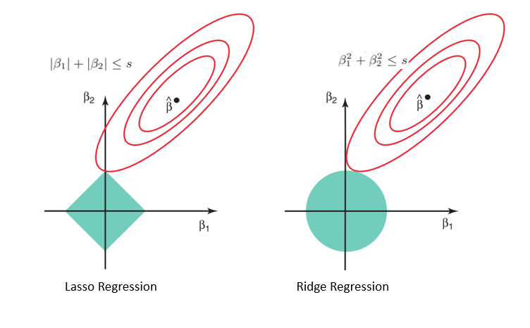

```{r packages, echo=FALSE, message=FALSE, warning=FALSE}
knitr::opts_chunk$set(echo = F, warning = F, messLC50 = F)

library(tidyverse)
library(NHANES)
library(ISLR)
library(leaps)
library(glmnet)
library(Rcpp)
library(pls)
set.seed(1)
library(lars)
```

```{r data, include = F}
data(diabetes)
z <- cbind(diabetes$x, y = diabetes$y)
z[,1:10] <- apply(z[,1:10], 2, scale)
diabetes <- as.data.frame(z) %>%
 rename("bp" = "map") 

mod_ls <- list(lm(y ~ bmi , diabetes),
               lm(y ~ bmi + ltg, diabetes),
               lm(y ~ bmi + bp + ltg , diabetes),
               lm(y ~ bmi + bp + tc + ltg, diabetes),
               lm(y ~ sex + bmi + bp+ hdl + ltg, diabetes),
               lm(y ~ sex + bmi + bp+ tc + ldl + ltg, diabetes),
               lm(y ~ sex + bmi + bp+ tc+ ldl + tch + ltg, diabetes),
               lm(y ~ sex + bmi + bp+ tc+ ldl + tch + ltg + glu, diabetes),
               lm(y ~ sex + bmi + bp+ tc+ ldl + hdl + tch + ltg + glu, diabetes),
               lm(y ~ ., diabetes  ))
```

class: center, middle

# Housekeeping

---


## Three popular classes of methods

1. **Subset selection**: identify a subset of the $p$ possible predictors that we believe to be related to $Y$, then fit least-squares model (previous lecture)

--

2. **Shrinkage** or **regularization**: fit a model involving all $p$ predictors, but the estimated coefficients are shrunken towards 0 relative to least-squares estimates (this lecture)

  - Can reduce variance and perform variable selection
  
--

3. **Dimension reduction**: project the $p$ predictors into a $q$-dimensional space where $q < p$ (this lecture)

  - Achieved using $q$ linear combinations or projections of the $p$ predictors, then fit least squares on the $q$ projections
  
---

class: middle, center 

# Shrinkage and Regularization

---

## Shrinkage methods

- Subset selection methods use least squares to fit a linear model that contains a subset of the predictors 

--

- Alternatively, could fit a model containing all $p$ predictors that *constrains* or *regularizes* the coefficient estimates

 - **Shrinks** coefficient estimates towards zero
 
--

- Two common methods: ridge regression and the Lasso

---

## Ridge regression

- Least-squares procedures estimates coefficients by using values that minimize

$$\text{RSS} = \sum_{i=1}^{n} \left(y_{i} - \beta_{0} - \sum_{j=1}^{p} \beta_{j} x_{ij}\right)^2$$
--
 
- The **ridge regression** coefficient estimates $\hat{\beta}^{R}$ are obtained by minimizing

$$\sum_{i=1}^{n} \left(y_{i} - \beta_{0} - \sum_{j=1}^{p} \beta_{j} x_{ij}\right)^2 + \lambda \sum_{j=1}^{p} \beta_{j}^2 = \text{RSS} +  \lambda \sum_{j=1}^{p} \beta_{j}^2$$

$\qquad$ where $\lambda \geq 0$ is a **tuning parameter** that is determined separately
 
---

## Ridge regression

Want to minimize: 
$$\color{orange}{\text{RSS}} + \color{red}{\lambda \sum_{j=1}^{p} \beta_{j}^2}$$

--

- Let's consider each component:

  - $\color{orange}{\text{RSS}}$: minimized when coefficient estimates fit the data well

--

  - $\color{red}{\lambda \sum_{j=1}^{p} \beta_{j}^2}$: **shrinkage penalty** minimized when the estimates are close to 0

    - Has effect of *shrinking* the estimates of $\beta_{j}$
  
    - Note: $\beta_{0}$ is *not* subject to penalty
  
---

## Ridge regression

Want to minimize: 
$$\color{orange}{\text{RSS}} + \color{red}{\lambda \sum_{j=1}^{p} \beta_{j}^2}$$
  
- $\lambda$ controls relative impact of the two components

 - What happens when $\lambda = 0$? When $\lambda \rightarrow \infty$?
 
---

## Ridge example: diabetes data

- Fit ridge regression predicting `LC50` using all predictors, for various $\lambda$

  - Plot on left: estimated coefficients $\hat{\beta}^{R}$ for each variable, as a function of $\lambda$

  - Plot on right: same ridge coefficient estimates, plotted as a function of $||\hat{\beta}_{\lambda}^{R}||_{2} / ||\hat{\beta} ||_{2}$, where $\hat{\beta}$ is vector of least-squares estimates
  
    - $||\beta||_{2}$ is the $l_{2}$-norm of a vector: $||\beta||_{2} = \sqrt{\sum_{j=1}^{p} \beta_{j}^2}$
    
    - $x$-axis can be thought of as amount of shrinkage
 
---

## Diabetes example

```{r ridge_ex, fig.align="center", fig.width=10, fig.height=6, cache = T}
pp <- length(mod_ls)
x <- diabetes[,1:10]

y <- diabetes$y
lambdas <- 10^seq(4, -3, by = -.1)
ridge_reg = glmnet::glmnet(x, y, nlambda = 25, alpha = 0, family = 'gaussian', lambda = lambdas)
ridge_betas <- coef(ridge_reg)


lin_reg <- lm(y ~ ., diabetes)
lin_reg_l2 <- sqrt(sum((coef(lin_reg)[-1])^2))

ridge_df <- data.frame(t(as.matrix(ridge_betas))) %>%
 dplyr::select(-1) %>%
 mutate(lambda = lambdas) %>%
 pivot_longer(cols = all_of(1:pp), names_to = "variable", values_to = "coefficient") %>%
 group_by(lambda) %>%
 mutate(ratio_l2 = sqrt(sum(coefficient^2))/lin_reg_l2) %>%
 ungroup()

p1 <- ggplot(ridge_df, aes(x = lambda, y = coefficient, col = variable))+
 geom_line(aes(linetype = variable), size = 1) +
 xlab(expression(lambda)) +
 theme_light() +
 labs(y = "Standardized coefficients") +
 theme(text = element_text(size = 20)) +
  scale_x_continuous(trans = "log10") 

 
p2 <- ggplot(ridge_df, aes(x = ratio_l2, y = coefficient, col = variable))+
 geom_line(aes(linetype = variable), size = 1) +
 xlab(expression(paste("||", hat(beta)[lambda]^R, "||",""[2], "/||", hat(beta)[lambda],"||",""[2] ))) +
 theme_light() +
 labs(y = "Standardized coefficients") +
 theme(text = element_text(size = 20))

ggpubr::ggarrange(p1, p2, ncol = 2, common.legend = T, legend = "bottom")
```

---


## Ridge regression: scaling

- Standard least-squares coefficient estimates are *equivariant* to scaling of the predictors

  - Example: suppose I fit model $Y = \beta_{0} + \beta_{1}X + \epsilon$. Results in fitted model with estimates $\hat{\beta}_{0}, \hat{\beta}_{1}$.
  
  - If I instead fit the model on  $Y = \beta_{0} + \beta_{1}(c\times X) + \epsilon$ $X_{j}$ for some constant $c$, then estimated coefficient is simply $\frac{1}{c}\hat{\beta}_{1}$

 - Enters $\text{RSS}$ the same: $X\beta_{1} = (c X)(\frac{1}{c}\beta_{1})$

 
---

## Ridge regression: scaling

- In contrast, ridge regression coefficients estimates can change *substantially* when multiplying a given predictor by a constant

 - This is due to shrinkage penalty on the $\beta_{j}$'s
 
--

- Therefore, we usually apply ridge regression after **standardizing** the predictors:

$$\tilde{x}_{ij} = \frac{x_{ij}}{\sqrt{\frac{1}{n} \sum_{i=1}^{n}(x_{ij} = \bar{x}_{j})^2}}$$

  - Each standard predictor $\tilde{X}_{j}$ will have standard deviation of 1, so final fit will not depend on the scale on which the predictors are measured
---

### Why does ridge do better?

- Generally, when the relationship between response and predictors is close to linear, least-squares estimates will be low bias but may have high variance

  - i.e. Small change in training data to lead to a dramatic change in estimates of least-squares coefficients
  


---
### Why does ridge do better?


```{r }
set.seed(9)
n <- 50
p <- 45
```

- Simulated data with $n=$ `r n` observations and $p =$ `r p` predictors

- Displaying variance, squared bias, and test MSE

```{r ridge_mse, fig.align = "center", fig.height=6, fig.width=7, cache = T}

beta <- rnorm(p)
s <- 2
get_bias = function(estimate, truth) {
  mean(estimate) - truth
}

get_mse = function(estimate, truth) {
  mean((estimate - truth) ^ 2)
}


x0 <- rnorm(p)
y0 <- c(x0 %*% beta + rnorm(1,0,s))

nsim <- 1000
lambdas <- 10^seq(4, -2, length = 100)
L <- length(lambdas)
preds <- matrix(NA,nrow = nsim, ncol = L)
for(j in 1:nsim){
 X <- matrix(rnorm(n*p), ncol = p, nrow = n)
 y <- X %*% c(beta) + rnorm(n,0,s)
 x <- apply(X,2,scale, center = F)
 
 ridge_reg <- glmnet::glmnet(x, y, nlambda = 25, alpha = 0, family = 'gaussian', lambda = lambdas,
                             intercept = F, standardize = F,  thresh = 1e-20)
 preds[j,] <- c(predict(ridge_reg, s = lambdas, newx = x0))
 
}


bias <- apply(preds,2,get_bias, truth = c(x0 %*% beta))
variance <- apply(preds,2,var)
mse <- apply(preds, 2, get_mse, truth = c(x0 %*% beta))

data.frame(bias2 = bias^2, variance = variance, mse = mse, lambda = lambdas) %>%
 pivot_longer(cols = 1:3, names_to = "stat") %>%
 # filter(lambda >1) %>%
 ggplot(., aes(x = lambda, y = value))+
 # geom_point()+
 geom_line(aes(col = stat)) +
 scale_x_continuous(trans = "log10") +
 geom_point(aes(x = lambdas[which(mse == min(mse))], y = min(mse)),
            shape = 4, size = 3) +
 labs(x = expression(lambda))+
  theme(text = element_text(size = 20))
```

---

## The Lasso

- One disadvantage of ridge regression: model will still include all $p$ predictors (in contrast to subset selection methods)

 - Shrinkage penalty $\color{red}{\lambda \sum \beta_{j}^2}$ will shrink, but not set, coefficients to 0
 
 - Difficult for model interpretation

--

- The **Lasso** is a relatively recent alternative to ridge that overcomes this disadvantage

- Lasso coefficients $\hat{\beta}_{\lambda}^{L}$ minimize the following:

$$\sum_{i=1}^{n} \left(y_{i} - \beta_{0} - \sum_{j=1}^{p} \beta_{j} x_{ij}\right)^2 + \lambda \sum_{j=1}^{p} |\beta_{j}| = \color{orange}{\text{RSS}} +  \color{purple}{\lambda \sum_{j=1}^{p} |\beta_{j}|}$$


---

## Lasso penalty

- Ridge minimizes $\color{orange}{\text{RSS}} + \color{red}{\lambda \sum_{j=1}^{p} \beta_{j}^2}$, whereas Lasso minimizes $\color{orange}{\text{RSS}} +  \color{purple}{\lambda \sum_{j=1}^{p} |\beta_{j}|}$

- Lasso uses an $l_{1}$ penalty (i.e. absolute weights, instead of squared)

 - $l_{1}$ norm of $p$-vector $\beta$ is $||\beta||_{1} = \sum_{j=1}^{p} |\beta_{j}|$
 
--

- This $l_{1}$ penalty forces some of the coefficient estimates to be exactly 0 when $\lambda$ is sufficiently large

- Thus, Lasso performs *variable selection*

--

 - We say that the Lasso yelds *sparse* models -- models that involve only a subset of the variables
 
--

- Need a select a good value for $\lambda$

---

## Lasso: diabetes data

- Now fitting Lasso model to response `LC50`

```{r lasso_diabetes, fig.align="center", fig.height=5.5, fig.width=10}
pp <- length(mod_ls)
x <- diabetes[,1:pp]

y <- diabetes$y
lambdas <- 10^seq(3, -2, by = -.1)
lasso = glmnet::glmnet(x, y, nlambda = 25, alpha = 1, family = 'gaussian', lambda = lambdas)
lasso_betas <- coef(lasso)


lin_reg <- lm(y ~ ., diabetes)
lin_reg_l1 <- sum(abs(coef(lin_reg)[-1]))

lasso_df <- data.frame(t(as.matrix(lasso_betas))) %>%
 dplyr::select(-1) %>%
 mutate(lambda = lambdas) %>%
 pivot_longer(cols = all_of(1:pp), names_to = "variable", values_to = "coefficient") %>%
 group_by(lambda) %>%
 mutate(ratio_l1 = sum(abs(coefficient))/lin_reg_l1) %>%
 ungroup()

p1 <- ggplot(lasso_df, aes(x = lambda, y = coefficient, col = variable))+
 geom_line(aes(linetype = variable), size = 1) +
 xlab(expression(lambda)) +
 theme_light() +
 labs(y = "Standardized coefficients") +
 theme(text = element_text(size = 20))+
  scale_x_continuous(trans = "log10") 
 
p2 <- ggplot(lasso_df, aes(x = ratio_l1, y = coefficient, col = variable))+
 geom_line(aes(linetype = variable), size = 1) +
 xlab(expression(paste("||", hat(beta)[lambda]^L, "||",""[1], "/||", hat(beta)[lambda],"||",""[1] ))) +
 theme_light() +
 labs(y = "Standardized coefficients") +
 theme(text = element_text(size = 20))

ggpubr::ggarrange(p1, p2, ncol = 2, common.legend = T, legend = "bottom")

```

--

- Depending on value of $\lambda$, the Lasso can produce a model involving any number of predictors
 
---

## Lasso and ridge

- Equivalent formulation of the problems:

  - Lasso coefficients estimates solve the problem

$$\min_{\beta}\left\{ \sum_{i=1}^{n} \left(y_{i} - \beta_{0} - \sum_{j=1}^{p} \beta_{j} x_{ij}\right)^2 \right\} \quad \text{ subject to } \sum_{j=1}^{p} |\beta_{j}| \leq s$$


  - Ridge coefficients solve the problem 

$$\min_{\beta}\left\{ \sum_{i=1}^{n} \left(y_{i} - \beta_{0} - \sum_{j=1}^{p} \beta_{j} x_{ij}\right)^2 \right\} \quad \text{ subject to } \sum_{j=1}^{p} \beta_{j}^2 \leq s$$

--

- $s$ can be thought of as a budget


---

## Lasso variable selection

- Why does the lasso result in estimated coefficients that are exactly equal to 0, whereas ridge regression does not?

-  Consider the following plot, where we have $p=2$ predictors

--

-Let $\hat{\beta} = (\hat{\beta}_{1}, \hat{\beta}_{2})$ be the least-squares solution

- The teal diamond and circle are regions that satisfy the Lasso and ridge regression budget constraints for a given $s$

--

- Each ellipse you will see is a *contour*; all the points on a particular ellipse have the same RSS

  - As ellipse expands away from $\hat{\beta}$, the RSS increases (confirm that this makes sense!)
  

---

## Lasso variable selection

- The Lasso and ridge coefficient estimates are given by the first point at which the ellipse contacts the contraint region (diamond and circle)

```{r fig.align="center",out.width="90%",echo=FALSE}

```


---


## Lasso variable selection

- Note: if $s$ is large (i.e. $\lambda = 0$), then constraint regions will contain $\hat{\beta}$

--

- Lasso constraint has corners at each of the axes, so ellipse will often intersect constraint region at an axis

  - For larger $p$, many of the coefficient estimates equal zero at the same time
  
  - In previous plot, Lasso results in setting $\hat{\beta}_{1}^{L} = 0$


---

## Prediction: Lasso

Data simulated with $p = 45$ predictors and $n = 50$ observations, but only 2 predictors actually associated with response

```{r lasso_mse,  cache = T}
set.seed(9)
n <- 50
p <- 45
beta <- c(5*rnorm(2), rep(0, p-2))
s <- 2


x0 <- rnorm(p)
y0 <- c(x0 %*% beta + rnorm(1,0,s))

nsim <- 500
L <- 50
lasso_lambdas <- 10^seq(1.5, -2, length.out  = L)
ridge_lambdas <- 10^seq(4,-2, length.out = L)
lasso_preds  <- ridge_preds <- matrix(NA,nrow = nsim, ncol = L)
lasso_r2 <- ridge_r2 <- matrix(NA,nrow = nsim, ncol = L)
for(j in 1:nsim){
 X <- matrix(rnorm(n*p), ncol = p, nrow = n)
 y <- X %*% c(beta) + rnorm(n,0,s)
 x <- apply(X,2,scale, center = F)
 
 lasso <- glmnet::glmnet(x, y, nlambda = 25, alpha = 1, family = 'gaussian', lambda = lasso_lambdas,
                             intercept = F, standardize = F,  thresh = 1e-20)
 ridge <- glmnet::glmnet(x, y, nlambda = 25, alpha = 0, family = 'gaussian', lambda = ridge_lambdas,
                             intercept = F, standardize = F,  thresh = 1e-20)
 lasso_preds[j,] <- c(predict(lasso, s = lasso_lambdas, newx = x0))
 lasso_r2[j,] <- lasso$dev.ratio
 ridge_preds[j,] <- c(predict(ridge, s = ridge_lambdas, newx = x0))
 ridge_r2[j,] <- ridge$dev.ratio
}


lasso_bias <- apply(lasso_preds,2,get_bias, truth = c(x0 %*% beta))
lasso_variance <- apply(lasso_preds,2,var)
lasso_mse <- apply(lasso_preds, 2, get_mse, truth = c(x0 %*% beta))


lasso_df <- data.frame(bias2 = lasso_bias^2, variance = lasso_variance, mse = lasso_mse, lambda = lasso_lambdas) %>%
 # mutate(R2 = colMeans(lasso_r2)) %>%
 pivot_longer(cols = 1:3, names_to = "stat") %>%
 mutate(model = "lasso")


p1 <- lasso_df %>%
 # filter(lambda >1) %>%
 ggplot(., aes(x = lambda, y = value))+
 # geom_point()+
 geom_line(aes(col = stat)) +
 scale_x_continuous(trans = "log10") +
 geom_point(aes(x = lasso_lambdas[which(lasso_mse == min(lasso_mse))], y = min(lasso_mse)),
            shape = 4, size = 3) +
 labs(x = expression(lambda))+
 guides(color = "none")+
  theme(text = element_text(size = 20))


r2_seq <- seq(0, 1, 0.025)
lasso_ids_ls <- ridge_ids_ls <- list()
for(i in 1:(length(r2_seq)-1)){
 lasso_ids_ls[[i]] <- which(lasso_r2 >= r2_seq[i] & lasso_r2 < r2_seq[i+1])
 ridge_ids_ls[[i]] <- which(ridge_r2 >= r2_seq[i] & ridge_r2 < r2_seq[i+1])
}

lasso_df_ls <- ridge_df_ls <- list()
for(i in 1:(length(r2_seq)-1)){
 lasso_df_ls[[i]] <- data.frame(bias = get_bias(lasso_preds[lasso_ids_ls[[i]]], c(x0 %*% beta)),
                                variance = var(lasso_preds[lasso_ids_ls[[i]]]),
                                mse = get_mse(lasso_preds[lasso_ids_ls[[i]]], c(x0 %*% beta)),
                                model = "lasso",
                                R2 = mean(lasso_r2[lasso_ids_ls[[i]]]))
 ridge_df_ls[[i]] <- data.frame(bias = get_bias(ridge_preds[ridge_ids_ls[[i]]], c(x0 %*% beta)),
                                variance = var(ridge_preds[ridge_ids_ls[[i]]]),
                                mse = get_mse(ridge_preds[ridge_ids_ls[[i]]], c(x0 %*% beta)),
                                model = "ridge",
                                R2 = mean(ridge_r2[ridge_ids_ls[[i]]]))
                             
}


p2 <- rbind(do.call(rbind, lasso_df_ls), do.call(rbind,ridge_df_ls)) %>% 
 pivot_longer(cols = 1:3, names_to = "stat") %>%
 ggplot(.,aes(x = R2, y = value, col = stat))+
 geom_line(aes(linetype = model), size = 1) +
 xlim(0.4, 1) +
 labs(x = expression(R^2))+
  theme(text = element_text(size = 20))

```


```{r fig.align = "center", fig.height=5, fig.width=8}
p1
```

---

## Prediction: Lasso vs Ridge

- Comparison of squared bias, variance, and test MSE between Lasso (solid) and ridge (dotted) models on same set of data

- Both are plotted against $R^2$ on training data

--

- Data were generated in a manner more closely aligned to Lasso than ridge

---


## Prediction: Lasso vs Ridge


```{r fig.align = "center", fig.height=5, fig.width=8}
p2
```

---
## Lasso vs Ridge

- Neither approach will universally dominant the other

- In general, we expect the Lasso to perform better when the response is a function of only a relatively small number of prodictors

- Ridge might perform better when the response is a function of many predictors, all with coefficients of roughly equal size

--

- The number of predictors related to $Y$ is never known *a priori* for real data

 - Using techniques such as CV can be used to determine which approach is better for a given dataset
 
---

### How to select tuning parameter?

- We require a method to determine which of the models under consideration is "best"

 - How to select $\lambda$ (or equivalently, the constraint $s$)?
 
--

- Cross-validation gives us a simple solution: choose a range/grid of $\lambda$ values, and compute the CV error rate for each value

 - Select the value of tuning parameter $\lambda^{*}$ for which CV error is smallest
 
- The re-fit the model using all of the available observations and $\lambda^{*}$

---

## Diabetes data

- I perform 5-fold CV to determine the optimal $\lambda^*$ value for applying ridge regression to the `diabetes` 

  - That is, the 5 folds are determined first and do not change
  
  - Then we implement the cross-validation method 51 times, once for every value in $\lambda = (0.001, 0.0126, ..., 3.98, 5.01, ..., 79.43, 100)$
  
- The plots display the estimated 5-fold CV test error for each $\lambda$, as well as the estimated $\hat{\beta}_{j}^{R}$

---

## k-fold CV: diabetes data

- Dashed line denotes $\lambda^*$. What do these plots tell us?


```{r fig.align="center", fig.height=6, fig.width=10}
set.seed(3)
x <- model.matrix(y ~., diabetes)[,-1]
y <- diabetes$y
n <- nrow(x)
# train_ids <- sample(1:n)
lambdas <- 10^seq(2,-3,-0.1)
cv.out <- cv.glmnet(x, y, alpha = 0, nfolds = 5, lambda = lambdas)
lambda_star <- cv.out$lambda.min
p1 <- data.frame( lambda = cv.out$lambda, cv_error = cv.out$cvm) %>%
 ggplot(.,aes(x = lambda, y = cv_error)) + 
 geom_line(col = "blue") +
 scale_x_continuous(trans = "log10") +
 geom_vline(xintercept = lambda_star, linetype = "dashed")+
 xlab(expression(lambda))+
  theme(text = element_text(size = 20))

p2 <- t(as.matrix(cv.out$glmnet.fit$beta)) %>%
 as.data.frame() %>% 
 mutate(lambda = cv.out$lambda) %>%
 pivot_longer(cols = -lambda, names_to = "variable") %>%
 ggplot(., aes(x = lambda, y = value, col = variable)) + 
 geom_line() +
  scale_x_continuous(trans = "log10") +
 geom_vline(xintercept = lambda_star, linetype = "dashed")+
 labs(x =expression(lambda), y = "Standardized coefficients") +
  theme(text = element_text(size = 20))
 
ggpubr::ggarrange(p1, p2, ncol = 2, legend = "bottom")
 
```
 
---

## Simulated data

- Return to the case of $n = 50$ and $p=45$, but only 2 predictors are actually related to the response

- Perform LOOCV to obtain optimal $\lambda^*$ for Lasso model

--

- The following plots shows the estimated LOOCV error and estimated $\hat{\beta}_{j}^{L}$ plotted against various $\lambda$ values

---

## LOOCV: simulated data

- Dashed line is once again optimal $\lambda^{*}$. What do these plots tell us?

```{r lasso_loocv, fig.align="center", fig.height=6, fig.width=10}
# 562
set.seed(5)
n <- 50
p <- 45
beta <- c(3*rnorm(2), rep(0, p-2))
s <- 2
X <- matrix(rnorm(n*p), ncol = p, nrow = n)
y <-  X %*% c(beta) + rnorm(n,0,s)
x <- apply(X,2,scale, center = F)
cv.out <- cv.glmnet(x, y, alpha = 1, nfolds = n,  intercept = F)
lambda_star <- cv.out$lambda.min
lambdas <- cv.out$lambda

lin_reg_l1 <- sum(abs(coef(lm(y ~ -1 +x))))


lasso_df <- data.frame(t(as.matrix(cv.out$glmnet.fit$beta))) %>%
 # dplyr::select(-1) %>%
 mutate(lambda = lambdas) %>%
 pivot_longer(cols = -lambda, names_to = "variable", values_to = "coefficient") %>%
 group_by(lambda) %>%
 mutate(ratio_l1 = sum(abs(coefficient))/lin_reg_l1) %>%
 ungroup()

p1 <- lasso_df %>% 
 dplyr::select(ratio_l1, lambda) %>%
 distinct() %>%
 mutate(cv_error = cv.out$cvm) %>%
 ggplot(., aes(x = lambda, y = cv_error))+
 geom_line(col = "blue")+
 xlab(expression(lambda))  +
 geom_vline(xintercept = lambda_star, linetype = "dashed")+
  theme(text = element_text(size = 20))

p2 <- lasso_df %>%
 mutate(keep = case_when(variable == "V1" ~ "V1",
                         variable == "V2" ~ "V2")) %>%
 ggplot(.,aes(x = lambda, y = coefficient, col = keep, group = variable))+
 geom_line()+
 guides(col = "none") +
 scale_color_manual(values = c("purple", "orange"), na.value = "grey50")+
 xlab(expression(lambda))  +
 geom_vline(xintercept = lambda_star, linetype = "dashed") +
 ylab("Standardized Coefficients")+
  theme(text = element_text(size = 20))

ggpubr::ggarrange(p1, p2, ncol = 2, legend = "bottom")

```

---

## Summary

- High-dimensional data (small $n$, large $p$) are becoming more available

- Research into methods that give *sparsity* (such as the Lasso) are thriving research areas

--

- Selection and regularization methods can help avoid overfitting!

- We usually do not perform these methods to interpret the values of the $\hat{\beta}_{j}^{R}$ or $\hat{\beta}_{j}^{L}$ themselves

  - Rather, we often just want to learn which predictors (if any) are actually related to the response, or to obtain good predictions
  
--

- Uncertainty quantification is difficult

