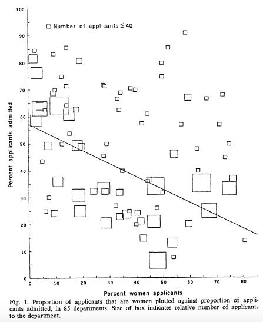

layout: true

<div class="my-footer">
<span>
<a href="http://datasciencebox.org" target="_blank">datasciencebox.org</a>
</span>
</div> 

---

```{r setup, include=FALSE}
knitr::opts_chunk$set(echo = TRUE,
                      warning=FALSE,
                      message=FALSE,
                      fig.height = 2.65, 
                      dpi = 300) 
```

```{r, echo=FALSE}
library(tidyverse)
```

## Announcements

- HW 01 - due **Monday, September 16 at 12p (noon)**


- Writing Exercise 1
    - Draft Response: 9/12 - 9/14
    - Peer Review: 9/15 - 9/17
    - Final Revision: 9/18 - 9/19

---


class: center, middle

# Scientific studies

---

## Scientific studies

- <font class="vocab">Observational</font>
    - Collect data in a way that does not interfere with how the data arise ("observe")
    - Only establish an association
- <font class="vocab">Experimental</font>
    - Randomly assign subjects to treatments
    - Establish causal connections

.question[
Design a study comparing average energy levels of people who do and do not exercise -- both as an observational study and as an experiment.
]

---

### Study: "Cereal Keeps Girls Slim"

.small[
Girls who ate breakfast of any type had a lower average body mass index, a common obesity gauge, than those who said they didn't. The index was even lower for girls who said they ate cereal for breakfast, according to findings of the study conducted by the Maryland Medical Research Institute with funding from the National Institutes of Health (NIH) and cereal-maker General Mills.

[...]

The results were gleaned from a larger NIH survey of 2,379 girls in California, Ohio, and Maryland who were tracked between the ages of 9 and 19.

[...]

As part of the survey, the girls were asked once a year what they had eaten during the previous three days....
]
<br>

.footnote[
Source: [Study: Cereal Keeps Girls Slim](https://www.cbsnews.com/news/study-cereal-keeps-girls-slim/)
]

---

### 3 possible explanations

--

- Eating breakfast causes girls to be slimmer 
<br>

--

- Being slim causes girls to eat breakfast
<br>

--

- A third variable is responsible for both -- a confounding variable 

--

.alert[
A <font class="vocab">confounding</font> variable is an an extraneous variable that affects both the explanatory and the response variable, and that make it seem like there is a relationship between them
]

---

## Correlation != causation

<br><br>
.center[

]
<br><br>

.footnote[
Randall Munroe CC BY-NC 2.5 http://xkcd.com/552/
]

---

## Studies and conclusions


```{r sample_grid, echo=FALSE, out.width = 700, fig.align="center"}
knitr::include_graphics("img/08/random_sample_assign_grid.png")
```


---

### Non-random samples: a cautionary tale

In 2016, the Natural Environment Research Council in England
started an online competition in an effort to name a polar research
ship. People were invited to submit suggestions and/or cast a vote for
their favorite choice.

.question[
What type of sampling design is this? 
]

[What happened?](https://www.cnn.com/2016/04/18/world/boaty-mcboatface-wins-vote/index.html)

---

class: center, middle

# Conditional probability

---

## Conditional probability: Review


.question[
A January 2018 SurveyUSA poll asked 500 randomly selected Californians whether they are familiar with the DREAM act. The distribution of the responses by age category are shown below.

What proportion of **<u>all respondents</u>** are very familiar with the DREAM act?  
]
<br>
.pull-left[
|            | 18 - 49 | 50+ | Total |
|------------|---------|-----|-------|
| Very       | 90      | 32  | 122   |
| Somewhat   | 125     | 86  | 211   |
| Not very   | 56      | 33  | 89    |
| Not at all | 36      | 24  | 60    |
| Not sure   | 9       | 9   | 18    |
| Total      | 316     | 184 | 500   |

<br><br>
]


--
.pull-right[
$P(\text{Very}) = \frac{122}{500} = 0.244$
]

<br>
.footnote[
  Source: [SurveyUSA News Poll 23754](http://www.surveyusa.com/client/PollReport.aspx?g=783743b0-efc1-4b67-9201-58352a8f61f1)
]

---

.question[
A January 2018 SurveyUSA poll asked 500 randomly selected Californians whether they are familiar with the DREAM act. The distribution of the responses by age category are shown below.

What proportion of **<u>respondents who are 18 - 49 years old</u>** are very familiar with the DREAM act?
]
<br>
.pull-left[
|            | 18 - 49 | 50+ | Total |
|------------|---------|-----|-------|
| Very       | 90      | 32  | 122   |
| Somewhat   | 125     | 86  | 211   |
| Not very   | 56      | 33  | 89    |
| Not at all | 36      | 24  | 60    |
| Not sure   | 9       | 9   | 18    |
| Total      | 316     | 184 | 500   |
]
--
.pull-right[
$P(\text{Very}~|~18-49) = \frac{90}{316} = 0.285$
]

---

.question[
A January 2018 SurveyUSA poll asked 500 randomly selected Californians whether they are familiar with the DREAM act. The distribution of the responses by age category are shown below.

What proportion of **<u>respondents who are 50+ years old</u>** are very familiar with the DREAM act?
]
<br>
.pull-left[
|            | 18 - 49 | 50+ | Total |
|------------|---------|-----|-------|
| Very       | 90      | 32  | 122   |
| Somewhat   | 125     | 86  | 211   |
| Not very   | 56      | 33  | 89    |
| Not at all | 36      | 24  | 60    |
| Not sure   | 9       | 9   | 18    |
| Total      | 316     | 184 | 500   |
]
--
.pull-right[
$P(\text{Very}~|~50+) = \frac{32}{184} = 0.173$
]

---

.question[
Given that

- $P(\text{Very}) = \frac{122}{500} = 0.244$

- $P(\text{Very}~|~18-49) = \frac{90}{316} = 0.285$

- $P(\text{Very}~|~50+) = \frac{32}{184} = 0.173$

does there appear to be a relationship between age and familiarity with the DREAM act? Explain your reasoning.
]

--

<br>

.question[
Could there be another variable that explains this relationship?
]

---

## Independence

.question[
Inspired by the previous example and how we used the conditional probabilities to make conclusions, come up with a definition of independent events. If easier, you can keep the context limited to the example (independence/dependence of familiarity with the DREAM act and age), but try to push yourself to make a more general statement.
]

---

class: center, middle

# Simpson's paradox

---

## Relationships between variables

- **Bivariate relationship**: Fitness $\rightarrow$ Heart health

- **Multivariate relationship**: Calories + Age + Fitness $\rightarrow$ Heart health

---

## Simpson's paradox

- Not considering an important variable when studying a relationship can result in <font class="vocab">Simpson's paradox</font>, a phenomenon in which the omission of one explanatory variable can affect the measure of association between another explanatory variable and a response variable. 


- In other words, the inclusion of a third variable in the analysis can change the apparent relationship between the other two variables. 

---

## Simpson's paradox

```{r simpsons_plot, echo=FALSE, message=FALSE,fig.align="center"}
df <- tribble(
  ~x1, ~y, ~x2,
  2,   4,  0,
  3,   3,  0,
  4,   2,  0,
  5,   1,  0,
  6,   11, 1,
  7,   10, 1,
  8,   9,  1,
  9,   8,  1
)
ggplot() +
  geom_point(data = df, aes(x1, y)) +
  geom_smooth(data = df, aes(x1, y), method = lm, se = FALSE, 
              color = "black", linetype = "dashed")
```

---

## Simpson's paradox 

```{r simpsons_plot2, echo=FALSE, message=FALSE,fig.align="center"}
ggplot() +
  geom_point(data = df, aes(x1, y, color = factor(x2))) +
  geom_smooth(data = df, aes(x1, y, color = factor(x2)), method = lm) +
  geom_smooth(data = df, aes(x1, y), method = lm, se = FALSE, 
              color = "black", linetype = "dashed") +
  labs(color = "x2")
```

---

## Glimpse of data in tidy form

```{r admissions_data, echo = F}
department <- c(rep("A", 933), rep("B", 585), rep("C", 918), rep("D", 792), rep("E", 584), rep("F", 714))
apply <- c(rep("Male: Admit", 511), rep("Male: Deny", 314 ), rep("Female: Admit", 89), rep("Female: Deny", 19),
           rep("Male: Admit", 353), rep("Male: Deny", 207 ), rep("Female: Admit", 17), rep("Female: Deny", 8),
           rep("Male: Admit", 120), rep("Male: Deny", 205 ), rep("Female: Admit", 202), rep("Female: Deny", 391),
           rep("Male: Admit", 138), rep("Male: Deny", 279 ), rep("Female: Admit", 131), rep("Female: Deny", 244),
           rep("Male: Admit", 54), rep("Male: Deny", 137 ), rep("Female: Admit", 94), rep("Female: Deny", 299),
           rep("Male: Admit", 22), rep("Male: Deny", 351 ), rep("Female: Admit", 24), rep("Female: Deny", 317))

admissions <- data.frame(department = factor(department), apply = apply) %>% 
  mutate(gender = if_else(str_detect(apply, "Female"), "female", "male"), 
         decision = if_else(str_detect(apply, "Admit"), "admit", "deny")) %>%
  mutate(decision = factor(decision, levels = c("deny", "admit"))) %>%
  dplyr::select(-apply) 
```

```{r glimpse_berkley}
glimpse(admissions)
```

.footnote[
[https://en.wikipedia.org/wiki/Simpson%27s_paradox](https://en.wikipedia.org/wiki/Simpson%27s_paradox)
]

---

## Overall distribution of acceptance by gender

.question[
  What type of visualization would be appropriate for representing this data?
]

```{r berkley_prop}
admissions %>%
  count(gender, decision) %>%
  group_by(gender) %>%
  mutate(prop_admit = n / sum(n))
```

---

## Overall distribution of acceptance

```{r berkley_hist, echo = F}
ggplot(admissions, mapping = aes(x = gender, fill = decision))+
  geom_bar(position = "fill") +
  labs(y = "", title = "Admission decisions by gender")
```

---


## Closer look

Let's look at data from the six largest departments, labeled A-F:

| Department | Female: Admit | Female: Total | Male: Admit | Male: Total
|------------|---------|-----|-------|------|
| A       | 89      | 108  | 511   | 825|
| B   | 17     | 25  | 353   | 560 |
| C   | 202      | 593  | 120    | 227 |
| D |  131     | 375  | 138    | 417 |
| E   | 94       | 393   | 54    | 191|
| F      | 24     | 341 | 22   | 373


---

## UC Berkeley admissions: condition on department

.question[
  Within each department, what is the probability of admittance for each gender? 
  That is, within Department X, what are $P(\text{man admit} | \text{department X})$ and $P(\text{woman admit} | \text{department X})$?
]

| Department | Female: Admit | Female: Total | Male: Admit | Male: Total|
|------------|---------|-----|-------|------|
| A       | 89      | 108  | 511   | 825|
| B   | 17     | 25  | 353   | 560 |
| C   | 202      | 593  | 120    | 227 |
| D |  131     | 375  | 138    | 417 |
| E   | 94       | 393   | 54    | 191|
| F      | 24     | 341 | 22   | 373|

---

## UC Berkeley admissions: Conditional probabilities


```{r echo = F}
women <- round(prop.table(table(department, apply)[,1:2], margin = 1 )[,1], 2)
men <- round(prop.table(table(department, apply)[,3:4], margin = 1 )[,1], 2)
all <- round((table(department, apply)[,1] +table(department, apply)[,3] )/rowSums(table(department, apply)), 2)
knitr::kable(cbind(women, men,all))
```

---


## Distribution of acceptance by department

.pull_left[
```{r berkley_count_group}
admissions %>%
  count(department, gender, decision)
```
]

.pull_right[
```{r berkley_prop_group}
admissions %>%
  count(department, gender, decision) %>%
  group_by(department, gender) %>%
  mutate(prop_admit = n / sum(n)) 
```
]

<br>

.question[
  What type of visualization would be appropriate for representing this data?
]

---


## Distribution of acceptance by department

```{r berkley_hist_facet, echo = F}
ggplot(admissions, mapping = aes(x = gender, fill = decision))+
  geom_bar(position = "fill") +
  facet_wrap(~department) +
  labs(y = "", title = "Admission decisions by gender and department")
```

---

## UC Berkeley admissions: closer look

| Department | Female: Total | Female: Acceptance | Male: Total | Male: Acceptance |
|------------|---------|-----|-------|------|
| A       | 108      |  0.82 | 825 | 0.62 |
| B   | 25     |  0.68  | 560   | 0.63 |
| C   | 593     | 0.34  | 227    | 0.37 |
| D |  375    | 0.35  | 417    | 0.33 |
| E   | 393      | 0.24   | 191    | 0.28 |
| F      | 341     | 0.07 | 373   | 0.06 |

<br>

- Are the departments uniform in their admission rates? Notice how **A** and **B** have highest acceptance.

- Rank departments by total number of male applicants: **A** > **B** > D > C > F > E

- Rank departments by total number of female applicants: C > E > D > F > **A** > **B**

---

## UC Berkeley admissions: plot

```{r bickel_plot, echo=FALSE, out.width=400, fig.align="center"}

```

<br>

.footnote[
  [https://homepage.stat.uiowa.edu/~mbognar/1030/Bickel-Berkeley.pdf](https://homepage.stat.uiowa.edu/~mbognar/1030/Bickel-Berkeley.pdf)
]


