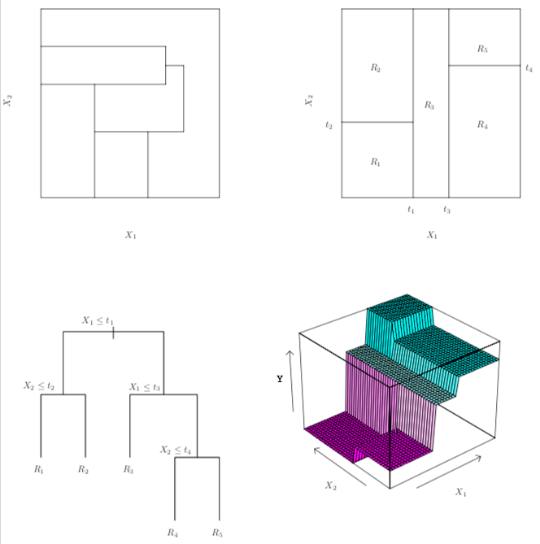
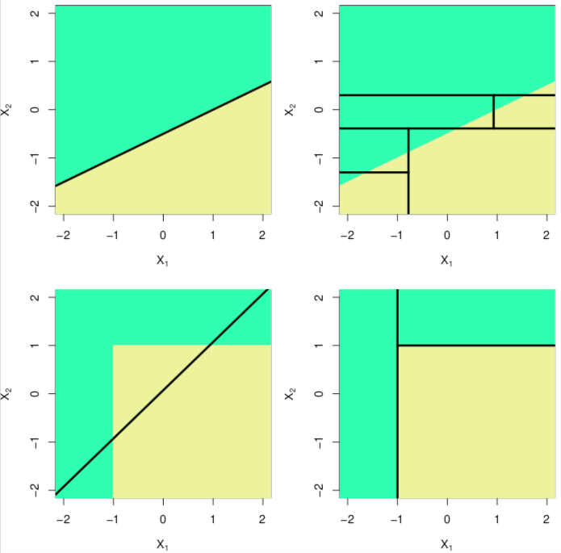

```{r packages, echo=FALSE, message=FALSE, warning=FALSE}
knitr::opts_chunk$set(echo = F, warning = F, message = F, fig.align = "center", fig.width = 5, fig.height = 5)

library(tidyverse)
library(broom)
library(ISLR)
library(tree)
library(lars)
library(randomForest)
library(gbm)
set.seed(1)
abalone <- read.table("data/abalone_data.txt", sep = ",",header = T)
abalone <- abalone %>%
  mutate_at(vars(-rings, - sex), function(x){x*200}) %>%
  mutate(rings = rings + runif(nrow(abalone), -0.5,0.5),
         age = rings + 1.5,
         weight = whole_wt)

heart<- read.table("data/heart_cleveland.txt", header = T, sep = ",") %>% 
  mutate(cp = as.factor(cp),
         sex = ifelse(sex == 1, "M", "F"),
         target = ifelse(target == 0,0, 1))
seeds <- read.table("data/seeds_dataset.txt", header = T) %>%
  mutate(variety= case_when(variety == 1~ "Kama",
                          variety == 2 ~ "Rosa",
                          T ~ "Canadian"),
         variety = as.factor(variety))
data(diabetes)
z <- cbind(diabetes$x, y = diabetes$y)
z[,1:10] <- apply(z[,1:10], 2, scale)
diabetes <- as.data.frame(z) %>%
 rename("bp" = "map",
        "total_chol" = "tc") 
```

class: center, middle

# Housekeeping

---

## Tree-based methods

- These methods use a series of if-then rules to divide/segment the predictor space into a number of simple regions

- The splitting rules can be summarized in a tree, so these approaches are known as **decision-tree** methods

- Can be simple and useful for interpretation

- Decision trees can be applied to both regression and classification problems


--

- Typically not competitive with the best supervised learning approaches in terms of prediction accuracy

--

- We will discuss **bagging**, **random forests**, and **boosting**

---

## Diabetes data

- Diabetes disease progression colored from low (purple) to high (red)

```{r}
ggplot(diabetes, aes(x= age, y = total_chol, col =y))+
 geom_point()+
 scale_color_gradientn(colours = rainbow(5)[5:1]) +
 labs(y = "total cholesterol")+
 guides(col = "none")+
  theme(text = element_text(size = 20))
```

---

### Diabetes data: decision tree 

- A regression tree for predicting diabetes progression based on a person's age and total cholesterol

```{r diabetes_simple_tree, fig.width=8, fig.height=6}
set.seed(1)
tree_diabetes <- tree(y ~ age + total_chol, diabetes)
plot(tree_diabetes, col = "blue")
text(tree_diabetes, pretty = 0)
```

---


### Diabetes data: decision tree 


- Top split: observations with $\color{blue}{\text{total cholesterol}} > 0.126$ are assigned to right branch

 - Predicted progression is mean response value for observations with $\color{blue}{\text{total cholesterol}} > 0.126$: $\hat{y} =$ `r round(mean(diabetes[diabetes$total_chol > 0.126,]$y),1)`
 
- Observations with $\color{blue}{\text{total cholesterol}} < 0.126$ assigned to left branch, and further subdivided by $\color{blue}{\text{age}}$

--

- This tree has two *internal nodes* and three *terminal nodes*

 - The number in each terminal nodes is the mean of $Y$ for the observations that fall there
 
---

## Terminology

- **Internal nodes**: points along the tree where the predictor space is split

 - First node is often referred to as **root node**

- **Terminal nodes** or **leaves**: regions where there is no further splitting

 - Decision trees are typically drawn upside down (leaves at bottom)
 
--

- What are the internal nodes and terminal nodes for these data?

---


### Diabetes data: results

- The tree stratifies the individuals into three regions of predictor space: $R_{1} = \{ X | \color{blue}{\text{total_chol} > 0.126}\}$, $R_{2} = \{ X | \color{blue}{\text{total_chol}} < 0.126, \color{blue}{\text{age}} < 0.075\}$, and $R_{3} = \{ X | \color{blue}{\text{total_chol}} < 0.126, \color{blue}{\text{age}} > 0.075\}$

```{r diabetes_regions}
c1 <-  0.1259
c2 <- 0.0749

xmin <- min(diabetes$age); xmax <- max(diabetes$age)
ymin <- min(diabetes$total_chol); ymax <- max(diabetes$total_chol)
ggplot(diabetes, aes(x= age, y = total_chol))+
 geom_point(col = "orange")+
 labs(y = "total cholesterol")+
 guides(col = "none") +
 geom_segment(x = xmin-1, xend = xmax+1, y = c1, yend = c1)+
 geom_segment(x = c2, xend = c2, y = c1, yend = ymin-1)+
 coord_cartesian(xlim =  c(xmin,xmax), ylim= c(ymin,ymax))+
 annotate("text", x = mean(c(xmin,xmax)), y = mean(c(c1, ymax)), label = expression(R[1]), size = 5) +
 annotate("text", x = mean(c(xmin,c2)), y = mean(c(c1, ymin)), label = expression(R[2]) ,size = 5) +
 annotate("text", x = mean(c(c2,xmax)), y = mean(c(c1, ymin)), label = expression(R[3]), size = 5) +
 theme(text = element_text(size = 20))

```

---

### Diabetes data: interpretation of results

- $\color{blue}{\text{total cholesterol}}$ is the most important factor for determining $\color{blue}{\text{diabetes progression}}$, and younger patients have less progression than older patients

--

- Given that a patient has higher $\color{blue}{\text{total cholesterol}}$, their age seems to play little role in their $\color{blue}{\text{diabetes progression}}$

- But among those who have cholesterol levels less than 0.126, the $\color{blue}{\text{age}}$ of a patient does affect $\color{blue}{\text{diabetes progression}}$


--

- Likely an over-simplification of the true relationships between $\color{blue}{\text{total cholesterol}}$, $\color{blue}{\text{age}}$, and $\color{blue}{\text{diabetes progression}}$

 - But easy to display and interpret
 
---

## Building a regression tree

1. Divide predictor space (the set of possible values for $X_{1}, \ldots, X_{p}$) into $L$ distinct and non-overlapping regions, $R_{1}, \ldots, R_{L}$

--

2. For every observation that lands in $R_{l}$, we output the same prediction: the mean of the training responses in $R_{l}$, $\hat{y}_{R_{l}} = \frac{1}{n_{l}} \sum_{i \in R_{l}} y_{i}$

--

What do these $R_{l}$ look like?

---

## Building a regression tree

- In theory, regions $R_{1},\ldots, R_{L}$ could have any shape. For simplicity, we divde predictor space into high-dimensional rectangle or *boxes*

--

- Goal: find boxes $R_{1},\ldots, R_{L}$ that minimize RSS, given by

$$\sum_{l=1}^{L} \sum_{i\in R_{l}} (y_{i} - \hat{y}_{R_{l}})^2$$

--

- However, it is computationally infeasible to consider every possible partition of the feature space into $L$ boxes

---


## Building a regression tree

- We take a **top-down, greedy** approach known as *recursive binary splitting*

 - "Top-down": we begin at the top of tree where all observations belong to a single region, and then succesively partition
 
 - "Greedy": at each step, the *best* split is made rather than looking ahead and picking a split that would be better in some future step
 
--

- Making splits on the data as we go

---

## Details

- First, select the predictor $X_{j}$ and the cutpoint $s$ such that splitting the predictor space into the regions $\{X | X_{j} < s\}$ and $\{X | X_{j} \geq s\}$ leads to greatest possible reduction in RSS

 - In the diabetes example, the predictor was $\color{blue}{\text{total cholesterol}}$ and $s = 0.126$
 
--

- Then, repeat the process of looking for the best predictor and best cutpoint in order to split the data further so as to minimize RSS within each of the resulting regions

 - Instead of splitting entire predictor space, we split one of the two previously identified regions
 
 - Now we have three regions
 
--

- Again, split one of these further so as to minimize RSS. We continue this process until a stopping criterion is reached

---

## Splitting example

```{r out.width="66%"}

```

.footnote[Gareth James, Daniela Witten, Trevor Hastie, Robert Tibshirani (2013). An introduction to statistical learning : with applications in R. New York :Springer]

---

## Possible issues

- This process may produce good predictions on the training set, but is likely to overfit the data. Why?

--

- A smaller tree with fewer splits/regions might lead to lower variance and better interpretation, at the cost of a little bias

--

- One possibile fix: build the tree only so long as the decrease in the RSS due to each split exceeds some (high) threshold

 - Will result in smaller trees, but may be short-sighted
 
---

## Tree pruning

- A better strategy is to grow a very large tree $T_{0}$, and then **prune** it back in order to obtain a smaller **subtree**

 - Idea: remove sections that are non-critical
 
--

 - How to best prune the tree? A CV approach might be intuitive, but is expensive
 
--

- **Cost complexity pruning** or weakest link pruning: consider a sequence of trees indexed by a nonnegative tuning parameter $\alpha$. For each value of $\alpha$, there is a subtree $T \subset T_{0}$ such that 

$$\sum_{l=1}^{|T|} \sum_{i: x_{i} \in R_{l}} (y_{i} - \hat{y}_{R_{l}})^2 + \alpha |T|$$
 is as small as possible. 
 
--

 - $|T|$ = number of terminal nodes of tree $T$
 
 - $R_{l}$ is the rectangle corresponding to the $l$-th terminal node
 
---

## Cost-complexity pruning cont.

- $\alpha$ controls trade-off between subtree's complexity and fit to the training data

--

 - What is the resultant tree $T$ when $\alpha = 0$?

--
 - What happens as $\alpha$ increases? 
 
--

  - Feels similar to the Lasso, maybe?

--

- Select an optimal $\hat{\alpha}$ using cross-validation, then return to full data set and obtain the subtree corresponding to  $\hat{\alpha}$

---

## Algorithm for building tree

0. Split data into train and validation sets

--

1. Using recursive binary splitting to grow a large tree on the training data, stopping according to a pre-determined stopping rule

--

2. Apply cost complexity pruning to the large tree in order to obtain a sequence of best trees as a function of $\alpha$

--

3. Use $k$-fold CV to choose $\alpha$: divide training data into $K$ folds. For each $k = 1,\ldots, K$:

 a) Repeat Steps 1 and 2 on all but the $k$-th fold
 
 b) Evaluate mean squared prediction error on the data in held-out $k$-th fold, as a function of $\alpha$
 
--

 Average the result for each $\alpha$, and pick $\hat{\alpha}$ that minimizes the average error
 
--

4. Return the subtree from Step 2 that corresponds to $\hat{\alpha}$

---

## Diabetes example

- Split data into 50/50 train and validation set

- Use all predictors to build the large tree

```{r}
set.seed(1)
train_ids <- sample(1: nrow(diabetes), nrow(diabetes)/2)
tree_diabetes <- tree(y ~. , diabetes[train_ids,], 
                      control=tree.control(nobs = length(train_ids), mindev = 0))
summary(tree_diabetes)
```

---

## Diabetes example cont.

```{r diabetes_cv, cache = T, fig.width=8}
# CV for different alpha levels k
K<- 5
cv_diabetes <- cv.tree(tree_diabetes, K = 10)
ids <- split(train_ids, ceiling(seq_along(1:length(train_ids))/(length(train_ids)/K))) 

y_train <- diabetes$y[train_ids]
y_test <- diabetes$y[-train_ids]
alphas <- (prune.tree(tree_diabetes)$k)[-c(1, length(prune.tree(tree_diabetes)$k))]
M <- (prune.tree(tree_diabetes)$size)[-c(1, length(prune.tree(tree_diabetes)$k))]
test_mse <- train_mse <- rep(NA, length(alphas))
for(i in 1:length(alphas)){
 # for  regression tree, devaince is sum of squared errors

 m <- alphas[i]
 prune_diabetes <- prune.tree(tree_diabetes, k = m)
  # train
 train_mse[i] <- mean((predict(prune_diabetes, diabetes[train_ids,]) - y_train)^2)
 
 ## test
 test_mse[i] <-  mean((predict(prune_diabetes,diabetes[-train_ids,]) - y_test)^2)
 
}


## k-fold CV
cv_preds <- matrix(NA, nrow = K, ncol = length(alphas))
for(k in 1:K){
   temp_tree <- tree(y ~., data = diabetes[unlist(ids[-k]),])
   temp_prune <- prune.tree(temp_tree)
   # M_curr <- temp_prune$size[-length(temp_prune$size)]
   for(i in 1:length(alphas)){
     m <- alphas[i]
     preds <- predict( prune.tree(temp_tree, k = m),  diabetes[ids[[k]],])
     cv_preds[k,i] <- mean((preds - diabetes$y[ids[[k]]])^2)
   }
   
}

cv_mse <- colMeans(cv_preds)


data.frame(size = M, test = test_mse, train = train_mse, cv = cv_mse) %>%
 pivot_longer(cols = -1, names_to = "type") %>%
 ggplot(., aes(x = size, y = value, col = type))+
 geom_point() + 
 geom_line()+
 scale_x_continuous(breaks = seq(1,max(M), 4))+
 labs(x = "Tree size", y = "Mean squared error")+
 theme(text = element_text(size = 20))

alpha_hat <- alphas[which(cv_mse == min(cv_mse))]
min_size <- M[which(cv_mse == min(cv_mse))]
```

- $K$-fold CV with $K = 5$. Best CV MSE at `r min_size` leaves

- Note: while the CV error is computed as a function of $\alpha$, we often display as a function of $|T|$, the number of leaves

---

## Diabetes example: final result

```{r fig.height = 8, fig.width=8}
tree_full <- tree(y ~. , diabetes, 
                      control=tree.control(nobs = nrow(diabetes), mindev = 0))
prune_final <- prune.tree(tree_full, k = alpha_hat)
plot(prune_final)
text(prune_final, pretty = 0)
```

---

class: middle, center

## Classification trees

---

## Classification trees

- Very similar to regression tree, but now we are predicting a qualitative response

- Now, we predict that each observation belongs to the *most commonly occurring class* of training observations in the region to which it belongs

 - Often time, also interested in class proportions among training observations that fall in the region
 
---

## Classification trees

- Just like regression trees, use recursive binary splitting to grow the classification tree

- Now, RSS cannot be used as a criterion for making the splits

- Alternative: **classification error rate**, the fraction of training observations in the region that belong to the most common class:

$$E = 1 - \max_{k}(\hat{p}_{lk})$$
 where $\hat{p}_{lk}$ is the proportion of training observations in the region $R_{l}$ that are from class $k$
 
--

- However, classification error is not sufficiently sensitive to tree-growing

---

## Gini index

- The **Gini index** is a measure of the total variance across the $K$ classes

$$G_{l} = \sum_{k=1}^{K} \hat{p}_{lk} (1 - \hat{p}_{lk})$$

- $G_{l}$ is small if all the $\hat{p}_{lk}$'s are close zero or one

--

- For this reason, Gini index is referred to as a measure of node *purity*
 
 - A small $G_{l}$ indicates that the node contains predominantly observations from a single class
 

---
## Gini index

$$G_{l} = \sum_{k=1}^{K} \hat{p}_{lk} (1 - \hat{p}_{lk})$$

- Example: 3 classes and 9 observations in three regions

```{r}
data.frame(Region1 = c(rep("A", 9), rep("B", 0), rep("C", 0)),
           Region2 = c(rep("A", 2), rep("B", 2), rep("C", 5)),
           Region3 = c(rep("A", 3), rep("B", 3), rep("C", 3))) %>%
  print.data.frame()
```

- In these three regions, what are the Gini indices $G_{1}, G_{2}, G_{3}$?
--
  - $G_{1} = 1(1-1) + 0(1-0) + 0(1-0) = 0$
  - $G_{2} = \frac{2}{9}(1-\frac{2}{9}) +\frac{2}{9}(1-\frac{2}{9}) + \frac{5}{9}(1-\frac{5}{9}) \approx 0.60$
  - $G_{3} = \frac{1}{3}(1-\frac{1}{3}) + \frac{1}{3}(1-\frac{1}{3})+\frac{1}{3}(1-\frac{1}{3}) = \frac{2}{3} \approx 0.67$

---

## Entropy

- Alternative to Gini index is **cross-entropy**:

$$D_{l} = -\sum_{k=1}^{K} \hat{p}_{lk} \log\hat{p}_{lk}$$

- Very similar to Gini index, so cross-entropy is also a measure of node purity

---

## Entropy

$$D_{l} = -\sum_{k=1}^{K} \hat{p}_{lk} \log\hat{p}_{lk}$$

- Same example: 3 classes and 9 observations in three regions

```{r}
data.frame(Region1 = c(rep("A", 9), rep("B", 0), rep("C", 0)),
           Region2 = c(rep("A", 2), rep("B", 2), rep("C", 5)),
           Region3 = c(rep("A", 3), rep("B", 3), rep("C", 3))) %>%
  print.data.frame()
```

- In these three regions, what are the cross-entropies $D_{1}, D_{2}, D_{3}$?

--

  - $D_{1} = -(1\log(1) + 0\log(0) + 0\log(0)) = 0$
  - $D_{2} = -(\frac{2}{9}\log(\frac{2}{9}) +\frac{2}{9}\log(\frac{2}{9}) + \frac{5}{9}\log(\frac{5}{9})) \approx 1$
  - $D_{3} = \frac{1}{3}(1-\frac{1}{3}) + \frac{1}{3}(1-\frac{1}{3})+\frac{1}{3}(1-\frac{1}{3}) = \frac{2}{3} \approx 1.1$


---

### Seeds data: full tree

- Recall the seeds data, where we have seven characteristics of three different grains: Kama, Rosa, and Canadian

--

```{r seeds, fig.width=6, fig.height=7}
seeds_full <- tree(variety ~., data = seeds,
                    control=tree.control(nobs = nrow(seeds), mindev = 0))
plot(seeds_full)
text(seeds_full)
title("Full tree")
```

---

## Seeds data: pruned tree

```{r seeds_cv, fig.height=8}
set.seed(2)
train <- sample(1:nrow(seeds), nrow(seeds)/2)
seeds_test <- seeds[-train,]
tree_seeds <- tree(variety ~. , data = seeds, subset = train)
cv_tree <- cv.tree(tree_seeds, FUN = prune.misclass)

best_size <- min(cv_tree$size[which(cv_tree$dev == min(cv_tree$dev))])
prune_seeds <- prune.misclass(tree_seeds, best = best_size)
plot(prune_seeds)
text(prune_seeds)
```


---

## Remarks

- The full classification tree for the seeds data has surprising characteristic: some splits yield two terminal nodes with the same predicted value

  - Why? The split increases node purity even if it may not reduce classification error
  
---

## Remarks

- We can also split on qualitative predictors. Consider again the abalone data, and we want to create a regression tree for $\color{blue}{\text{age}}$ using the predictor $\color{blue}{\text{age}} \in \{I, F, M\}$

```{r abalone_tree}
abalone_rl <- abalone %>%
 mutate(sex = factor(sex, c("I", "F", "M")))
plot(tree(age ~ sex, abalone_rl, control = tree.control(mindev= 0, nobs = nrow(abalone_rl))))
text(tree(age ~ sex, abalone_rl, control = tree.control(mindev= 0, nobs = nrow(abalone_rl))))
```
---

## Remarks cont.

- Trees vs. linear models: which is better? Depends on the true relationships between the response and the predictors


```{r out.width="50%"}

```

.footnote[Gareth James, Daniela Witten, Trevor Hastie, Robert Tibshirani (2013). An introduction to statistical learning : with applications in R. New York :Springer]
---

## Remarks cont.

- Advantages: 

 - Easy to explain, and may more closely mirror human decision-making than other approaches we've seen
 
 - Can be displayed graphically and interpreted by non-expert
 
 - Can easily handle qualitative predictors without the need to create dummy variables
 
--

- Disadvantages:

 - Lower levels of predictive accuracy compared to some other approaches
 
 - Can be non-robust 
 
--

However, we will see that aggregating many trees can improve predictie performance!

---

class: middle, center

## Aggregating trees 

---
## Bagging

- The decision trees described previously suffer from *high variance*, whereas linear regression tends to have low variance (when $n >> p$)

--


- An **ensemble method** is a method that combines many simple "building block" models in order to obtain a single final model

- **Bootstrap aggregation** or **bagging** is a general-purpose procedure for reducing the variance of a statistical-learning method

--

  - Given a set of $n$ independent observations $Z_{1}, \ldots, Z_{n}$, each with variance $\sigma^2$, then $\text{Var}(\bar{Z}) = \sigma^2/n$ (i.e. averaging a set of observations reduces variance)

 -  However, we typically don't have access to multiple training sets

---

## Bagging (in general)

- Instead, we can bootstrap by taking repeated samples from the single training set

- **Bagging**:

 1. Generate $B$ different bootstrapped training datasets
 
 2. Train our model on the $b$-th bootstrapped training set in order to get $\hat{f}^{*b}(x)$ for $b = 1,\ldots, B$
 
 3. Average all the predictions to obtain 
 
 $$\hat{f}_{\text{bag}}(x) = \frac{1}{B} \sum_{b=1}^{B} \hat{f}^{*b}(x)$$

---

## Bagging for decision trees

- To apply bagging to regression trees: 

 - Construct $B$ regression trees using $B$ bootstrapped training sets. For each tree, obtain predictions
 
 - Average the resulting predictions
 
 - Typically, trees are grown deep but not pruned
 
--

- For classification trees:

  - Construct $B$ classification trees using $B$ bootstrapped training sets

  - For each tree and each test observation, record the class $k$ predicted
  
  - Take a *majority vote*; the overall prediction for the test point is the most commonly occurring class among the B predictions
 
---

## Out-of-bag error estimation

- Estimating test error of bagged model is quite easy without performing CV

- On average, each bagged tree is fit using about 2/3 of the observations. Remaining 1/3 are **out-of-bag** (OOB) observations

--

- Can predict the response for $i$-th observation using each of the trees in which that observation was OOB

  - Yields about $B/3$ observations for observation $i$
  
--

  - Average or majority vote for OOB prediction for $i$
  
--

- When $B$ sufficiently large, OOB error is virtually equivalent to LOOCV


---

## Seeds data

```{r fig.width = 8, fig.height=5}
set.seed(14)
train <- sample(1: nrow(seeds), nrow(seeds)/2)
n_trees <- seq(2,200,1)
y_train <- seeds$variety[train]
y_test <- seeds$variety[-train]
oob_err_bag <- test_err_bag <- oob_err_rf <- test_err_rf <- rep(NA, length(n_trees))
for(i in 1:length(n_trees)){
  
  # bag when m = p
  bag_seeds <- randomForest(variety ~., data = seeds, subset = train,
                             mtry = 7, ntree = n_trees[i], importance= T)
  
  # random forest when m \neq p
  rf_seeds <- randomForest(variety ~., data = seeds, subset = train,
                             mtry = 2, ntree = n_trees[i], importance= T)
  oob_err_bag[i] <- mean(bag_seeds$err.rate[,1])
  test_err_bag[i] <- mean((predict(bag_seeds, seeds[-train,]) ) != y_test)
  
  oob_err_rf[i] <- mean(rf_seeds$err.rate[,1])
  test_err_rf[i] <- mean((predict(rf_seeds, seeds[-train,]) ) != y_test)
}


single_tree <- tree(variety ~. ,data = seeds, subset = train)
dt_err <- mean(predict(single_tree, seeds[-train,], type = "class") != y_test)

seeds_bag_rf_df <-  data.frame(B = n_trees, OOB_bag = oob_err_bag, Test_bag = test_err_bag,
           OOB_rf = oob_err_rf, Test_rf = test_err_rf)
seeds_bag_rf_df %>%
  dplyr::select(1:3) %>%
  pivot_longer(-B, names_to = "type", values_to = "Error")%>%
  ggplot(.,aes(x = B, y = Error, col = type))+
  # geom_point() + 
  geom_step() +
  labs(x = "Number of trees") +
  theme(text =element_text(size = 20))+
  geom_hline(yintercept = dt_err, linetype = "dashed") +
  scale_color_manual(values = c("blue", "orange"))

```

- Dashed line is test error rate for a single decision tree

---

## Variable importance measures

- Bagging can result in difficulty in interpretation

  - No longer clear which predictors are most important to the procedure

--

- Overall summary of important of each predictor using RSS or Gini index

  - Bagging regression trees: record total amount that RSS is decreased due to splits over a given predictor, averaged over B
  
  - Bagging classification trees: add up total amount that Gini index is decreased by splits over a given predictor, averaged over B


---

## Seeds data: importance 

```{r importance, fig.width=8, fig.height=6}
bag_seeds_all <- randomForest(variety ~., data = seeds, 
                           mtry = 7, ntree =200, importance= T)
importance_df <- data.frame(predictors = rownames(importance(bag_seeds_all)),
           mean_decrease= importance(bag_seeds_all)[,5]) %>%
  arrange(mean_decrease) %>%
  mutate(order = row_number())
importance_df %>%
  mutate(order = as.factor(order)) %>%
  ggplot(., aes(x  = order, y = mean_decrease))+
  geom_point(size = 3) +
  scale_x_discrete(labels = importance_df$predictors)+
  labs(y = "Mean decrease in Gini", x = "")+
  coord_flip()  +
  theme(text = element_text(size = 25))

```

---

## Random forests

- **Random forests** provide improvement over bagged trees by providing a small tweak that *decorrelates* the trees

- Like bagging, we build a number of decision trees on bootstrapped training samples

--

- Each time a split is considered, a *random sample* of $m$ predictors is chosen as splits candidates from the full set of $p$ predictors. Split on one of these $m$

--

  - At every split, we choose a new sample of $m$ predictors
  
  - Typically choose $m \approx \sqrt{p}$
  
---

## Random forests

- At each split, algorithm is *not allowed* to consider a majority of the available predictors

  - Intuition for why?

--

- Bagged trees may be highly correlated, and averaging correlated quantities does not reduce variance as much as average uncorrelated

--

- What happens when $m = p$?

--

- Small $m$ typically helpful when we have a large number of correlated predictors

---

## Seeds data

```{r fig.width = 8, fig.height=6}
seeds_bag_rf_df %>%
  pivot_longer(-B, names_to = "type", values_to = "Error")%>%
  ggplot(.,aes(x = B, y = Error, col = type))+
  # geom_point() + 
  geom_step() +
  labs(x = "Number of trees") +
  theme(text =element_text(size = 14))+
  geom_hline(yintercept = dt_err, linetype = "dashed") +
    scale_color_manual(values = c("blue", "pink" , "orange", "purple"))

```

- Here, $m \approx \sqrt{7} \approx 3$

---

## Boosting

- **Boosting**, like bagging, is a general approach that can be applied to many methods

- In bagging, each tree is built on a bootstrap data set, independent of the other $B-1$ trees

  - Then we combine all trees

--


- In boosting, the trees are grown *sequentially* -- each tree is grown using information from previously grown trees

--

- We do *not* take bootstrap samples; each tree is fit on a modified version of original data

---

## Boosting for regression trees

1. Set $\hat{f}(x) = 0$ and $r_{i} = y_{i}$ for all $i$ in the dataset

2. For $b = 1, 2,\ldots, B$, repeat:

  a) Fit a tree $\hat{f}^{b}(x)$ with $d$ splits ($d+1$ terminal nodes) to training data $(X,r)$
  
  b) Update $\hat{f}$ by adding a shrunken version of the new tree:
  
  $$\hat{f}(x) \leftarrow \hat{f}(x) + \lambda\hat{f}^{b}(x)$$
  
  c) Update residuals: 
  
  $$r_{i} \leftarrow r_{i} -\lambda\hat{f}^{b}(x)$$
  
3. Output boosted model

$$\hat{f}(x) = \sum_{b=1}^{B}\lambda\hat{f}^{b}(x)$$

---

## Boosting tuning parameters

1. Number of trees $B$: can overfit if $B$ too large (though occurs slowly)

  - Can use CV to select $B$

--

2. Shrinkage parameter $\lambda > 0$ control rate at which boosting learns

  - Typically, $\lambda = 0.01$ or $0.001$
  
--

3. Number $d$ of splits in each trees control complexity

  - Often $d=1$ works well, resulting in each tree being a *stump*
  
  - More generally, $d$ is interaction depth
  
---

## Boosting

- Boosting approach *learns slowly*

- Given current model, fit a decision tree to the residuals of that model. Add this new decision tree into fitted function to update residuals

--

- Fitting small trees to residuals allows slowly improving $\hat{f}$ in areas where it does not perform well

  - $\lambda$ slows the process down even further

--

- Boosting for classification trees is not discussed here

---

```{r boost_rf_heart, cache = T}
set.seed(10)
train <- sample(1:nrow(diabetes), nrow(diabetes)/2)
y_test <- diabetes$y[-train]

ntrees <- seq(500, 3000, 20)
mse_df <- matrix(NA, nrow = length(ntrees), ncol = 3)
for(i in 1:length(ntrees)){
  boost_heart1 <- gbm(y ~ ., data = diabetes[train,],
                   distribution = "gaussian",
                   n.trees = ntrees[i],
                   interaction.depth = 1,
                   shrinkage = 0.01)
  yhat_boost1 <- predict(boost_heart1, diabetes[-train,], n.trees = ntrees[i])
  
  boost_heart2 <- gbm(y ~ ., data = diabetes[train,],
                     distribution = "gaussian",
                     n.trees = ntrees[i],
                     interaction.depth = 2,
                     shrinkage = 0.01)
  yhat_boost2 <- predict(boost_heart2, diabetes[-train,], n.trees = ntrees[i])
  
  rf_heart <- randomForest(y ~. ,data = diabetes, subset = train,
                           mtry  = 3, ntree = ntrees[i], importance= F )
  yhat_rf <- predict(rf_heart, diabetes[-train,])
  
  mse_df[i,] <- c(mean((yhat_boost1 - y_test)^2),
                  mean((yhat_boost2 - y_test)^2),
                  mean((yhat_rf - y_test)^2))
}

data.frame(mse_df) %>%
  rename( "Boost1" = 1, "Boost2" = 2, "RF" = 3) %>%
  mutate(B = ntrees) %>%
  pivot_longer(cols = 1:3, names_to = "method", values_to = "MSE") %>%
  ggplot(., aes(x = B, y = MSE, col = method))+
  geom_line()


```

- plot with better data


---

## Summary

- Decision trees are simple and interpretable methods of regression and classification

- May not be as competitive with other methods w.r.t. predictive accuracy

- Bagging, random forests, and boosting are methods for improving predictive accuracy

  - Ensemble methods
  
  - Random forests and boosting are among state-of-the-art for supervised learning, but are less interpretable