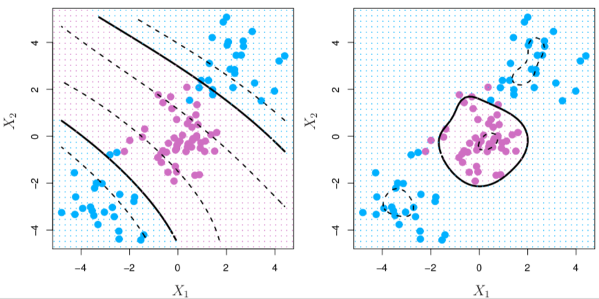

```{r packages, echo=FALSE, message=FALSE, warning=FALSE}
knitr::opts_chunk$set(echo = F, warning = F, message = F, fig.align = "center", fig.width = 5, fig.height = 5)

library(tidyverse)
library(broom)
library(ISLR)
library(tree)
library(lars)
library(pROC)
library(e1071)
set.seed(1)
abalone <- read.table("data/abalone_data.txt", sep = ",",header = T)
abalone <- abalone %>%
  mutate_at(vars(-rings, - sex), function(x){x*200}) %>%
  mutate(rings = rings + runif(nrow(abalone), -0.5,0.5),
         age = rings + 1.5,
         weight = whole_wt)

heart<- read.table("data/heart_cleveland.txt", header = T, sep = ",") %>% 
 filter(thal != "?", ca != "?") %>%
  mutate(cp = as.factor(cp),
         thal = as.numeric(thal),
         ca = as.numeric(ca),
         sex = ifelse(sex == 1, "M", "F"),
         target = ifelse(target %in% c(0),0, 1),
         target = as.factor(target))  
seeds <- read.table("data/seeds_dataset.txt", header = T) %>%
  mutate(variety= case_when(variety == 1~ "Kama",
                          variety == 2 ~ "Rosa",
                          T ~ "Canadian"),
         variety = as.factor(variety))
data(diabetes)
z <- cbind(diabetes$x, y = diabetes$y)
z[,1:10] <- apply(z[,1:10], 2, scale)
diabetes <- as.data.frame(z) %>%
 rename("bp" = "map",
        "total_chol" = "tc") 
```

class: center, middle

# Housekeeping

---

## Support Vector Machines

- Approach the binary classification problem in a direct way

- Support vector machines (SVM) perform well in a variety of settings

---

## Hyperplane

- In $p$-dimensions, a **hyperplane** is a flat affine subspace of dimension $p-1$

 - In $p = 2$ dimensions? $p = 3$?
 
--

- In 2-D, a hyperplane is defined by 

$$\beta_{0} + \beta_{1}X_{1} + \beta_{2}X_{2} = 0$$

 - Any $X = (X_{1}, X_{2})'$ for which the above holds is a point on the hyperplane
 
--

- More generally,

$$\beta_{0} + \beta_{1}X_{1} + \beta_{2}X_{2} + \ldots \beta_{p}X_{p} = 0$$

--

- $\beta = (\beta_{1}, \ldots, \beta_{p})$ is called the normal vector, and points in a direction orthogonal to surface of hyperplane

---

## Hyperplane in 2D

```{r hyperplane1, fig.width=8, fig.height=5}
get_x2 <- function(x1, b1, b2, b0, y){
 (y - b0 - b1*x1)/b2
}

b1 <- 0.5; b2 <- 1
b0 <- -4
x1 <- seq(0, 8, 0.1)
x2 <- get_x2(x1, b1,b2,b0, y = 0)


p1 <- ggplot()+
 geom_abline(slope = -b1/b2, intercept = -b0/b2, col = "blue")+
 # geom_abline(slope = -b1/b2, intercept = y2 - b0, col = "dark green")+
 geom_hline(yintercept = 0)+
 geom_vline(xintercept = 0) +
 xlim(min(x1), max(x1))+
 ylim(min(x2), max(x2)+1)+
 geom_segment(aes(x = 0, y = 0, xend = 2, yend = 2/b1),
              arrow = arrow(length = unit(0.25, "cm")), col = "red") +
 geom_point(aes(x = 5,  y = get_x2(5, b1,b2,b0, 0)), col = "blue") +
 geom_point(aes(x = 3,  y = get_x2(3, b1,b2,b0, 0)), col = "blue") +
 geom_point(aes(x = 1,  y = get_x2(1, b1,b2,b0, 0)), col = "blue") +
 geom_text(aes(x = 5 +0.5,  y = get_x2(5, b1,b2,b0, 0) + 0.5), 
           label = as.expression(bquote(beta[1]* x[1] + beta[2]*x[2] ~ .(b0) ~ "=" ~0)), 
           col = "blue", size = 7) +
 geom_text(aes(x = 2, y = 2/b1 + 0.25), label = expression(paste(beta, "= (" , beta[1], ",",  beta[2], ")")), col = "red", size = 7)+
 labs(x = expression(x[1]), y= expression(x[2])) +
 geom_text(aes(x = max(x1) - 1, y = max(x2)), label = as.expression(bquote(beta[1] ~ "=" ~ .(b1))), size = 7)+
  geom_text(aes(x = max(x1) - 1, y = max(x2)-0.5), label = as.expression(bquote(beta[2] ~ "=" ~ .(b2) )), size = 7) +
 theme(text = element_text(size = 16))
p1 
```

---

## Hyperplane in 2D

```{r hyperplane2, fig.width=8, fig.height=5}
x1_2 <- 2
y2 <- -2
p1 +
 geom_point(aes(x = x1_2, y = get_x2(x1_2, b1,b2, b0, -2)), col = "darkgreen") +
 geom_segment(aes(x = 0, y = 0, xend = x1_2, yend =get_x2(x1_2, b1,b2, b0, y2)), col = "darkgreen", linetype = "dashed") +
 geom_segment(aes(x = x1_2, y = get_x2(x1_2, b1,b2, b0, y2), xend = (y2 - b0)/(b2/b1 + b1/b2), yend =get_x2((y2 - b0)/(b2/b1 + b1/b2), b1,b2, b0, y2)), col = "darkgreen", linetype = "dashed")+
  geom_text(aes(x = x1_2+1.25 ,  y =  get_x2(x1_2, b1,b2, b0, -2)-0.25), 
           label = as.expression(bquote(beta[1]* x[1] + beta[2]*x[2] ~ .(b0) ~ "=" ~ .(y2))), 
           col = "darkgreen", size = 7) 
```

- The green point does not satisfy the equation, but rather: $\beta_{1} \times `r x1_2` + \beta_{2} \times `r get_x2(x1_2, b1,b2, b0, -2)`  `r b0` = `r y2` < 0$

---

## Simulated data

- So the hyperplane divides the $p$-dimensional space into parts. If $f(X) = \beta_{0} + \beta_{1}X_{1} + \ldots + \beta_{p} X_{p}$:

 - $f(X) < 0$ on one side 
 
 - $f(X) > 0$ on other side
 
 
```{r}
set.seed(1)
n <- 20
x1 <- c(runif(n/2, -2, 0), runif(n/2, 0.75, 3))
x2 <- c(3 + rnorm(n/2, x1[1:(n/2)]), rnorm(n/2, x1[(n/2):n]))
points_df <- data.frame(x1 = x1, x2 = x2, class = c(rep("A", n/2), rep("B", n/2)))
points_df <- points_df %>%
 arrange(class, x1)
points_df[11,1:2] <- c(1.74,  2.51)
points_df[12,1:2] <- c(2,1)
points_df[13, 2] <- 1.3
p1 <- points_df %>%
 ggplot(.,aes(x = x1, y = x2, col = class))+
 geom_point() +
 geom_abline(slope = 2, intercept = 0) +
 geom_abline(slope = 3, intercept = -1)+
 geom_abline(slope = 4, intercept = -0.5) +
 xlim(-2,3) +
 ylim(-1, 4)+
   coord_cartesian( expand = F)+
 scale_color_manual(values = c("orange", "blue"))+
 guides(col = "none")


 p2 <- ggplot()+
  geom_point(data = points_df, aes(x = x1, y = x2, col = class)) +
  geom_abline(slope = 2, intercept = 0) +
  scale_color_manual(values = c("orange", "blue"))+
  xlim(-2,3) +
  ylim(-1, 4) +
  geom_polygon(aes(x = c(-2, -2, 2, -0.5),
                   y = c(-1, 4, 4, -1)),
               fill = "orange",
               alpha = 0.2)+
  geom_polygon(aes(x = c(-0.5, 2, 3,3),
                 y = c(-1,4, 4, -1)),
             fill = "blue",
             alpha = 0.2) +
  coord_cartesian( expand = F)+
  guides(col = "none")
 
gridExtra::grid.arrange(p1,p2,ncol = 2)
```

---

## Separating hyperplanes

- Let $y_{i} = 1$ for the orange points, and $y_{i} = -1$ for the blue

- Hyperplanes that separate the training observations perfectly into their class labels are called **separating hyperplanes** 

--

 - Let $y_{i} =-1$ when $f(x) < 0$ and $y_{i} = 1$ when $f_{x} > 0$
 
 - If $y_{i} \times f(x_{i}) > 0$ for all $i$, then $f(x) = 0$ is a separating hyperplane
 
--

- If a separating hyperplane exists, a natural classifier comes to mind!

---

## Maximal margin hyperplane

- If data can be perfectly separated by a hyperplane, there will be infinitely many such hyperplanes

--

- **Maximal margin hyperplane** (MMH) is the separating hyperplane farthest from the training observations

 - Has farthest minimium distance to the training observations

```{r}

p1 <- c(-0.1835844, 0.6017157)
p2 <- c(1.74,  2.51)

seg_df <- data.frame(rbind(p1,p2)) %>%
  mutate(xend = 0.4*(0.5*X1 + X2),
        yend = 2*xend) %>%
 mutate(d=  sqrt((xend - X1)^2 + (yend - X2)^2))


ggplot()+
  # geom_point(data = points_df, aes(x = x1, y = x2, col = class)) +
  geom_abline(slope = 2, intercept = 0) +
  scale_color_manual(values = c("orange", "blue"))+
  xlim(-2,3) +
  ylim(-1, 4) +
  geom_polygon(aes(x = c(-2, -2, 2, -0.5),
                   y = c(-1, 4, 4, -1)),
               fill = "orange",
               alpha = 0.2)+
  geom_polygon(aes(x = c(-0.5, 2, 3,3),
                 y = c(-1,4, 4, -1)),
             fill = "blue",
             alpha = 0.2) +
  coord_cartesian( expand = F)+
  guides(col = "none") +
  geom_segment(data=seg_df, aes(x = X1, y = X2, xend = xend, yend = yend),
               arrow = arrow(length = unit(0.1 , "cm")))+
   geom_point(data = points_df, aes(x = x1, y = x2, col = class)) +
 geom_abline(intercept =-2*p1[1] + p1[2], slope = 2, linetype = "dashed") + 
  geom_abline(intercept =-2*p2[1] + p2[2], slope = 2, linetype = "dashed") +
 labs(x = expression(X[1]), y = expression(X[2]))

```


---

- Two training observations equidistant from the MMH on edges of margin are the **support vectors**

 - "Support" the MMH
 
 - MMH depends directly on the support vectors, but not on any other observations
 
--

 - Could have more than two equidistant

---

## Maximal marginal classifier

- *Maximal marginal classifier* if we classify according to the maximal marginal hyperplane

- Hope that the classifier that has a large margin for training data also has large margin for test data

--

- Construction: assume we have $n$ training observations $x_{1},\ldots, x_{n}$ with associated class labels $y_{i} \in \{-1, 1\}$. MMH is solution to

$$\max_{\beta_{0},\ldots, \beta_{p}, M} M \qquad \text{ subject to }$$

1. $\sum_{j=1}^{p} \beta_{j}^2 = 1$ 

2.  $y_{i}(\beta_{0} + \beta_{1} x_{i1} + \beta_{2} x_{i2} + \ldots + \beta_{p}x_{ip}) \geq M  \ \forall \ i = 1,\ldots, n$

--

 - $M$ represents the margin of our hyperplane, and solution chooses the $\beta$'s to maximize $M$


---

## Non-separable data


```{r}
set.seed(1)
n <- 20
x1 <- c(runif(n/2, -2, 1), runif(n/2, 0, 3))
x2 <- c(3 + rnorm(n/2, x1[1:(n/2)]), rnorm(n/2, x1[(n/2):n]))
points_df2 <- data.frame(x1 = x1, x2 = x2, class = c(rep("A", n/2), rep("B", n/2)))
points_df2 %>%
 ggplot(., aes(x = x1, y = x2, col = class))+
 geom_point(size = 2)+
 scale_color_manual(values = c("orange", "blue")) +
 labs(x = expression(X[1]), y = expression(X[2]))+
 guides(col = "none")+
 theme(text = element_text(size = 16))

```

- Data are not separable by a linear boundary! This is often the case unless $n < p$


---

## Noisy data

```{r}
points_df %>%
 add_row(x1 = -0.28, x2 = 0.4, class ="B") %>%
 ggplot(.,aes(x = x1, y = x2, col = class))+
 geom_point(size= 2) +
 geom_abline(slope = 2, intercept = 0) +
 xlim(-2,3) +
 ylim(-1, 4)+
   coord_cartesian( expand = F)+
 scale_color_manual(values = c("orange", "blue"))+
 labs(x = expression(X[1]), y = expression(X[2]))+
 guides(col = "none")+
 theme(text = element_text(size = 16))+
 geom_abline(slope = 1.07, intercept = 0.75, linetype = "dashed")


```

- Here, data are separable but noisy

- Can lead to poor solution for maximal marginal classifier (resulting margin is tiny!)

---

## Support vector classifier

- Develop a hyperplane that *almost* separates the classes to address non-separable and/or noisy data

--

- Gain robustness to individual observations and better classification for *most* of training observations

--

- **Support vector classifier** (or *soft* margin classifier) does this

 - Allows some observations to be on incorrect side of margin (or even the hyperplane)
 
---

## Support vector classifier

```{r fig.width=8, fig.height=7}
set.seed(1)
n <- 10
x <- c(runif(n/2, -2,-0.5), runif(n/2, 0.5, 2))
y <- rnorm(n, x, 0.25) + c(rep(2, n/2), rep(0, n/2))
points_df3 <- data.frame(x = x, y = y, class = c(rep("A", n/2), rep("B", n/2)) ) %>%
 add_row(x = -0.2, y = 1, class = "A") %>%
 add_row(x = 0.5, y = 1.5, class = "B") %>%
 rename("x1" = "x", "x2" = "y") %>%
 mutate(id = row_number())

svmfit <- svm(class ~ x2 + x1, data = points_df3 %>% mutate(class = as.factor(class)),
              kernel = "linear",cost = 1, scale = FALSE)

cf <- coef(svmfit)

p1 <- points_df3 %>%
 ggplot(., aes(y = x1, x=x2, col = class))+
 # geom_point()  +
 geom_abline(slope = -cf[2]/cf[3], intercept = -(cf[1] + 1)/cf[3], linetype ="dashed") +
  geom_abline(slope = -cf[2]/cf[3], intercept = -(cf[1] - 1)/cf[3], linetype ="dashed") +
 geom_abline(intercept = -cf[1]/cf[3], slope = -cf[2]/cf[3] ) +
 guides(col = "none") +
 labs(x = expression(X[1]), y = expression(X[2]))+
 geom_text(aes(label = id)) +
 theme(text = element_text(size = 16))


points_df4 <- points_df3 %>%
 add_row(x1 = -0.5, x2 = 0.75, class = "B", id = 13) %>%
 add_row(x1 = 0.7, x2 = 2, class = "A", id = 14)


svmfit2 <- svm(class ~ x2 + x1, data = points_df4 %>% mutate(class = as.factor(class)),
              kernel = "linear",cost = 1, scale = FALSE)

cf2 <- coef(svmfit2)

p2 <- points_df4 %>%
 ggplot(., aes(y = x1, x=x2, col = class))+
 # geom_point()  +
 geom_abline(slope = -cf2[2]/cf2[3], intercept = -(cf2[1] + 1)/cf2[3], linetype ="dashed") +
  geom_abline(slope = -cf2[2]/cf2[3], intercept = -(cf2[1] - 1)/cf2[3], linetype ="dashed") +
 geom_abline(intercept = -cf2[1]/cf2[3], slope = -cf2[2]/cf2[3] ) +
 guides(col = "none") +
 labs(x = expression(X[1]), y = expression(X[2]))+
 geom_text(aes(label = id))+
 theme(text = element_text(size = 16))


gridExtra::grid.arrange(p1, p2, ncol = 2)

```

- Plot on right is same data as on left, plus points 13 and 14

---

## Support vector classifier

- Classifies a test observation depending on which side of hyperplane it lies, where the hyperplane is solution to the optimization problem

$$\max_{\beta_{0}, \ldots, \beta_{p}, \epsilon_{1}, \ldots, \epsilon_{n}, M} M \quad \text{ subject to }$$

 1. $\sum_{j=1}^{p} \beta_{j}^2 = 1$
 
 2. $y_{i}(\beta_{0} + \beta_{1} x_{i1} + \beta_{2} x_{i2} + \ldots + \beta_{p}x_{ip}) \geq M (1- \epsilon_{i})$
 
 3. $\epsilon_{i} \geq 0$
 
 4. $\sum_{i=1}^{n} \epsilon_{i} \leq C$

--

- The $\epsilon_{i}$ are *slack variables* that allow indiviudal observations to be on wrong side 

 - $\epsilon_{i} = 0$ vs $> 0$ vs $>1$
 
--

- $C$ is a nonnegative tuning parameter

 - Interpretation of $C$?
 
--

 - Often selected using cross-validation

---

## Varying $C$

```{r}
set.seed(1)
n <- 30
x <- c(runif(n/2, -2,-0.5), runif(n/2, -0.5, 2))
y <- rnorm(n, x, 1) + c(rep(2, n/2), rep(0, n/2))
points_df3 <- data.frame(x = x, y = y, class = c(rep("A", n/2), rep("B", n/2)) ) %>%
 add_row(x = -0.2, y = 1, class = "A") %>%
 add_row(x = 0.5, y = 1.5, class = "B") %>%
 rename("x1" = "x", "x2" = "y") %>%
 mutate(id = row_number())


plot_ls <- list()
C_vec <- c(1,10,50,200) ## NOTE: this is different from how ISLR defines C
for(i in 1:length(C_vec)){
 svmfit <- svm(class ~ x2 + x1, data = points_df3 %>% mutate(class = as.factor(class)),
              kernel = "linear",cost = C_vec[i], scale = FALSE)

 cf <- coef(svmfit)

 plot_ls[[i]] <- points_df3 %>%
  ggplot(., aes(y = x1, x=x2, col = class))+
  geom_point()  +
  geom_abline(slope = -cf[2]/cf[3], intercept = -(cf[1] + 1)/cf[3], linetype ="dashed") +
   geom_abline(slope = -cf[2]/cf[3], intercept = -(cf[1] - 1)/cf[3], linetype ="dashed") +
  geom_abline(intercept = -cf[1]/cf[3], slope = -cf[2]/cf[3] ) +
  guides(col = "none") +
  labs(x = expression(X[1]), y = expression(X[2]))+
  # geom_text(aes(label = id)) +
  theme(text = element_text(size = 16))
}

gridExtra::grid.arrange(grobs = plot_ls, nrow = 2, ncol = 2)


```


---

## Remarks

- Support vector classifier's decision rule is based only on a potentially small subset of training observations

 - Robust to observations far away from hyperplane
 
--

- What happens when a linear boundary is unsatisfactory, no matter the choice of $C$?

```{r}
set.seed(11)
n <- 60
x <- c(runif(n/4, -2,-0.5), runif(n/4, 1, 3),  runif(n/2, -0.5, 1))
y <- rnorm(n, x, 0.5)
points_df4<- data.frame(x = x, y = y, class = c(rep("A", n/2), rep("B", n/2)) ) %>%
 rename("x1" = "x", "x2" = "y") %>%
 mutate(id = row_number())

svmfit <- svm(class ~ x2 + x1, data = points_df4 %>% mutate(class = as.factor(class)),
              kernel = "linear",cost = 500, scale = FALSE)

cf <- coef(svmfit)

ggplot()+
  geom_polygon(mapping = aes(x = c(-2.25,
                        2.4,
                        2.4,
                        -2.25), 
                  y = c(-2.25*(-cf[2]/cf[3]) -cf[1]/cf[3],
                        2.4*(-cf[2]/cf[3]) -cf[1]/cf[3],
                        -2.25*(-cf[2]/cf[3]) -cf[1]/cf[3],
                        -2.25*(-cf[2]/cf[3]) -cf[1]/cf[3])),
              fill = "orange",
              alpha = 0.2)+
  geom_polygon(mapping = aes(x = c(-2.25,
                        2.4,
                        -2.8,
                        -2.8), 
                  y = c(-2.25*(-cf[2]/cf[3]) -cf[1]/cf[3],
                        2.4*(-cf[2]/cf[3]) -cf[1]/cf[3],
                        2.4*(-cf[2]/cf[3]) -cf[1]/cf[3],
                        -2.25*(-cf[2]/cf[3]) -cf[1]/cf[3])),
              fill = "blue",
              alpha = 0.2)+
  geom_point(data = points_df4, aes(y = x1, x=x2, col = class))  +
  geom_abline(slope = -cf[2]/cf[3], intercept = -(cf[1] + 1)/cf[3], linetype ="dashed") +
   geom_abline(slope = -cf[2]/cf[3], intercept = -(cf[1] - 1)/cf[3], linetype ="dashed") +
  geom_abline(intercept = -cf[1]/cf[3], slope = -cf[2]/cf[3] ) +
  guides(col = "none") +
  labs(x = expression(X[1]), y = expression(X[2]))+
  scale_color_manual(values = c("orange", "blue")) +
  theme(text = element_text(size = 16))+
 coord_cartesian(expand = F)
```

---

## Feature expansion

- Rather than fit support vector classifier using $p$ features $X_{1}, \ldots, X_{p}$, enlarge feature space by including transformations

$$X_{1}^{2}, X_{1}^{3}, X_{1}X_{2}, X_{1}^2 X_{2}, \ldots$$

- Then fit support  vector classifier on enlarged space

- Results in non-linear decision boundary

---

example slide?

---

# Nonlinearities and kernels

- Clearly, there are too many ways we can enlarge the feature space

- A more controlled way of introducing nonlinearity into the classifier uses *kernels*

--

- Need to understand inner products in support-vector classifiers

 - If $a$ and $b$ are two vectors of length $r$, the **inner product** is 
 
 $$<a,b> = \sum_{i=1}^{r} a_{i} b_{i}$$
---

## Inner products and support vectors

- Inner product of two observations $x_{i}$ and $x_{i'}$

$$<x_{i}, x_{i'}> = \sum_{j=1}^{p} x_{ij}x_{i'j}$$

--

- Linear support vector can be represented as

$$f(x) = \beta_{0} + \sum_{i=1}^{n} \alpha_{i}<x, x_{i}>$$

 where there are $n$ parameters $\alpha_{i}$, one per training observation
 
--

- To estimate $\alpha_{1}, \ldots, \alpha_{n}$ and $\beta_{0}$, need the $\binom{n}{2}$ inner products $<x_{i}, x_{i'}>$ between all pairs of training observations

--

- It turns out $\alpha_{i} \neq 0$ only for support vectors in the solution! So if $\mathcal{S}$ is set of indices of support points,

$$f(x) = \beta_{0} + \sum_{i \in \mathcal{S}} \alpha_{i}<x, x_{i}>$$


---

## Kernels

- If we can compute inner products between observations, can fit a SV classifier!

- Generalizations of the inner product via a  **kernel** function $K(x_{i}, x_{i'})$

--

- E.g. *linear* kernel returns SV classifier: $$K(x_{i}, x_{i'}) = \sum_{j=1}^{p} x_{ij} x_{i'j}$$

--

- *Polynomial kernel* of degree $d$ computes inner-products needed for $d$-dimensional polynomials:

$$K(x_{i}, x_{i'}) = \left(1 + \sum_{j=1}^{p} x_{ij} x_{i'j}\right)^{d}$$

 - Try for $p=2$, $d=2$
 
 - What happens when $d=1$?
 
---

## Support vector machines

- When SV classifier is combined with a non-linear kernel, the resulting classifier is known as a **support vector machine** (SVM)

--

- Solution has form:
 
 $$f(x) = \beta_{0} + \sum_{i \in \mathcal{S}} \alpha_{i} K(x, x_{i})$$
 
---

## Radial kernel

- Another popular non-linear kernel is *radial* kernel

$$K(x_{i}, x_{i'}) = \exp\left(-\gamma \sum_{j=1}^{p} (x_{ij} - x_{i'j}^2)\right)$$

- If a test observaton $x^{*}$ is far from training observations $x_{i}$, $K(x^{*}, x_{i})$ will be tiny $\Rightarrow$ $x_{i}$ plays little to no role in $f(x^{*})$

 - Radial kernel has very *local* behavior


---

## Nonlinear kernels

```{r out.width="70%"}

```

.footnote[Gareth James, Daniela Witten, Trevor Hastie, Robert Tibshirani (2013). An introduction to statistical learning : with applications in R. New York :Springer]

---

## Advantages of kernels

- Computational efficiency

 - Only need to compute $K(x_{i}, x_{i'})$ for all $\binom{n}{2}$ distinct observation pairs without explicitly enlarging feature space
 
 - Implicit feature space in some kernels
 
 
---

## Example: heart data

```{r}
set.seed(36)
library(ROCR)
rocplot=function(pred, truth, ...){
   predob = prediction(pred, truth)
   perf = performance(predob, "tpr", "fpr")
   plot(perf,...)}
n <- nrow(heart)
train <- sample(1:n, 207)
# par(mfrow=c(1,2))
svmfit.opt=svm(target~., data=heart[train,], kernel="linear",gamma=2,
               cost=1,type = 'C-classification')
svmfit.flex1=svm(target~., data=heart[train,], kernel="radial",gamma=0.1, cost=1, type = 'C-classification')
svmfit.flex2=svm(target~., data=heart[train,], kernel="radial",gamma=0.01, cost=1, type = 'C-classification')
svmfit.flex3=svm(target~., data=heart[train,], kernel="radial",gamma=0.001, cost=1, type = 'C-classification')

mod_log <- glm(target ~. , data = heart[train,], family = "binomial")
pred_log <- predict(mod_log, heart[-train,], type = "response")
pred_log <- ifelse(pred_log > 0.5, 1, 0)

# fitted=predict(svmfit.opt,heart[train,],type = 'C-classification')
# rocplot(as.numeric(fitted)-1,heart[train,"target"],main="Training Data")

# fitted=predict(svmfit.flex,heart[train,],type = 'C-classification')
# rocplot(as.numeric(fitted)-1,heart[train,"target"],add=T,col="red")

fitted <- predict(svmfit.opt, newdata = heart[-train,],type = 'C-classification')
rocobj <- roc(heart[-train,"target"], as.numeric(fitted)-1)

# rocplot(as.numeric(fitted)-1,heart[-train,"target"],main="Test Data")

fitted <- predict(svmfit.flex1, newdata = heart[-train,],type = 'C-classification')
rocobj2 <- roc(heart[-train,"target"], as.numeric(fitted)-1)

# rocplot(as.numeric(fitted)-1,heart[-train,"target"],add=T,col="red")

fitted <- predict(svmfit.flex2, newdata = heart[-train,],type = 'C-classification')
rocobj3 <- roc(heart[-train,"target"], as.numeric(fitted)-1)

# rocplot(as.numeric(fitted)-1,heart[-train,"target"],add=T,col="blue")

fitted <- predict(svmfit.flex3, newdata = heart[-train,],type = 'C-classification')
rocobj4 <- roc(heart[-train,"target"], as.numeric(fitted)-1)
# rocobj4 <- roc(heart[-train,"target"], pred_log)
# rocplot(as.numeric(fitted)-1,heart[-train,"target"],add=T,col="green")

ggroc(list(p1 = rocobj, p2 = rocobj2, p3 = rocobj3, p4 = rocobj4)) +
 scale_color_discrete(labels = c("Support Vector Classifier", "SVM: 0.1", "SVM: 0.01", "SVM = 0.001"))
```

---


## SVM: more than two classes

- How to extend to $K>2$ classes? Two popular approaches:

 1. One-versus-One (OvO)
 
 2. One-versus-All (OvA)
 
--

- OvO: fit $\binom{K}{2}$ SVMs $\hat{f}_{kl}(x)$, one for each pair of classes. Classify $x^{*}$ to the class that wins most of the pairwise competitions

--

- OvA: fit $K$ SVMs $\hat{f}_{k}(x)$, each time comparing one class $k$ to the remaining $K-1$ classes. Classify $x^{*}$ for which $\hat{f}_{k}(x^{*})$ is largest 

--

- If $K$ not too large, choose OvO

---

## SVM vs Logistic 

- When classes nearly separable, SVM does better than logistic regression

- If not, logistic (with ridge penalty) and SVM very similar

- Logistic yields better predictions of probabilities

- For nonlinear boundaries, kernel SVMs are popular
