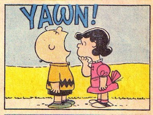

layout: true

<div class="my-footer">
<span>
<a href="http://datasciencebox.org" target="_blank">datasciencebox.org</a>
</span>
</div> 

```{r packages, echo=FALSE, message=FALSE, warning=FALSE}
library(tidyverse)
library(broom)
library(knitr)
library(DT)
library(emo)
library(infer)
library(openintro)
```

```{r setup, include=FALSE}
# R options
options(
  htmltools.dir.version = FALSE, # for blogdown
  show.signif.stars = FALSE,     # for regression output
  warm = 1
  )
# Set dpi and height for images
opts_chunk$set(fig.height = 2.25, fig.width = 5, dpi = 300) 
# ggplot2 color palette with gray
color_palette <- list(gray = "#999999", 
                      salmon = "#E69F00", 
                      lightblue = "#56B4E9", 
                      green = "#009E73", 
                      yellow = "#F0E442", 
                      darkblue = "#0072B2", 
                      red = "#D55E00", 
                      purple = "#CC79A7")
htmltools::tagList(rmarkdown::html_dependency_font_awesome())
# For magick
dev.off <- function(){
  invisible(grDevices::dev.off())
}
# For ggplot2
ggplot2::theme_set(ggplot2::theme_bw())
```

---

class: middle, center

### [Click for PDF of slides](10b-sim-test-pt2.pdf)

---

### Announcements

- HW 04 **due Thu, Nov 14 at 11:59p**

- Project data analysis due December 3

  
---

### Hypothesis testing framework

- Start with a null hypothesis, $H_0$, that represents the status quo

- Set an alternative hypothesis, $H_A$, that represents the research question, 
i.e. what we’re testing for

- Conduct a hypothesis test under the assumption that the null hypothesis is true and 
calculate a <font class="vocab">p-value</font> (probability of observed or more extreme outcome given that the 
null hypothesis is true)
    - if the test results suggest that the data do not provide convincing evidence for 
    the alternative hypothesis, stick with the null hypothesis
    - if they do, then reject the null hypothesis in favor of the alternative

---

class: center, middle

### Testing for independence

---

### Is yawning contagious?

.question[
Do you think yawning is contagious?
]

.pull-left[

]
.pull-right[

]

---

### Is yawning contagious?

An experiment conducted by the MythBusters tested if a person can be subconsciously influenced into yawning if another person near them yawns.

[https://www.discovery.com/tv-shows/mythbusters/videos/is-yawning-contagious-2](https://www.discovery.com/tv-shows/mythbusters/videos/is-yawning-contagious-2)

--

.question[
**Do we buy their conclusion?**
]

---

### Study description

In this study 50 people were randomly assigned to two groups: 34 to a group where a person near them yawned (treatment) and 16 to a control group where they didn't see someone yawn (control).

```{r message=FALSE}
mb_yawn <- read_csv("data/mb-yawn.csv")
```

```{r}
mb_yawn %>%
  count(group, outcome)
```

---

### Proportion of yawners

.small[
```{r}
mb_yawn %>%
  count(group, outcome) %>%
  group_by(group) %>%
  mutate(p_hat = n / sum(n))
```
]

- Proportion of yawners in the treatment group: $\frac{10}{34} = 0.2941$
- Proportion of yawners in the control group: $\frac{4}{16} = 0.25$
- Difference: $0.2941 - 0.25 = 0.0441$
- Our results match the ones calculated on the MythBusters episode.

---

### Independence?

.question[
Based on the proportions we calculated, 
do you think yawning is really contagious, i.e. are seeing someone yawn 
and yawning dependent?
]

```{r echo=FALSE}
mb_yawn %>%
  count(group, outcome) %>%
  group_by(group) %>%
  mutate(p_hat = n / sum(n))
```

---

### Dependence, or another possible explanation?

- The observed differences might suggest that yawning is contagious, i.e. seeing someone yawn 
and yawning are dependent.

- But the differences are small enough that we might wonder if they might simple be **due to chance**.

- Perhaps if we were to repeat the experiment, we would see slightly different results.

- So we will do just that - well, somewhat - and see what happens.

- Instead of actually conducting the experiment many times, we will **simulate** our results.

---

### Two competing claims

- "There is nothing going on." 
Yawning and seeing someone yawn are <font class="vocab">independent</font>, yawning is not contagious, observed difference in proportions is simply due to chance. $\rightarrow$ Null hypothesis

- "There is something going on."
Yawning and seeing someone yawn are <font class="vocab">dependent</font>, yawning is contagious, observed difference in proportions is not due to chance. $\rightarrow$ Alternative hypothesis

---

### Simulation setup

1. A regular deck of cards is comprised of 52 cards: 4 aces, 4 of numbers 2-10, 4 jacks, 4 queens, and 4 kings.

2. Take out two aces from the deck of cards and set them aside.
    - Take out Jokers if you have them.

3. The remaining 50 playing cards to represent each participant in the study:
    - 14 face cards (including the 2 aces) represent the people who yawn.
    - 36 non-face cards represent the people who don't yawn.

---

### Running the simulation

1. Shuffle the 50 cards at least 7 times<sup>1</sup> to ensure that the cards counted out are from a random process.

2. Count out the top 16 cards and set them aside. These cards represent the people in the control group.

3. Out of the remaining 34 cards (treatment group) count the <font color="red">number of face cards</font> (the number of people who yawned in the treatment group).

4. Calculate the difference in proportions of yawners (treatment - control). 

5. Send one group member to the front of the room to input your group's difference in proportions.

.footnote[
[1] http://www.dartmouth.edu/~chance/course/topics/winning_number.html
]

---

### Simulation by hand - Your results

.question[
Do the simulation results suggest that yawning 
is contagious, i.e. does seeing someone yawn and yawning appear to be dependent?
]

```{r echo = F, message = F, warning = F}
sim_data <- read_csv("data/yawn_sim.csv")
```

```{r echo=F, eval = F}
ggplot(data = sim_data, mapping = aes(x = diff_in_prop)) +
  geom_histogram(binwidth = 0.05) + 
  labs(title = "Your Results: Difference in Proportion of Yawners ")
```

---

### Simulation by hard - Your results

.pull-left[
```{r echo=F}
sim_data %>% 
  arrange(diff_in_prop) %>% 
  slice(1:12) %>% 
  select(diff_in_prop)
```
]


.pull-right[
```{r echo=F}
sim_data %>% 
  arrange(diff_in_prop) %>% 
  slice(13:24) %>% 
  select(diff_in_prop)
```
]

---

### Simulation by computation

```{r}
set.seed(110719)
null_dist <- mb_yawn %>%
  specify(response = outcome, explanatory = group, 
          success = "yawn") %>%
  hypothesize(null = "independence") %>%
  generate(1000, type = "permute") %>%
  calculate(stat = "diff in props", 
            order = c("treatment", "control"))
```

---

### Simulation by computation - 1

.small[
- Start with the data frame
- **Specify the variables**
    - **Since the response variable is categorical, specify the level which should be considered as "success"**

```{r eval=FALSE}
mb_yawn %>%
{{  specify(response = outcome, explanatory = group, 
          success = "yawn") }}
```
]

---

### Simulation by computation - 2

.small[
- Start with the data frame
- Specify the variables
    - Since the response variable is categorical, specify the level which should be considered as "success"
- **State the null hypothesis (yawning and whether or not you see someone yawn are independent)**

```{r eval=FALSE}
mb_yawn %>%
  specify(response = outcome, explanatory = group, 
          success = "yawn") %>%
{{ hypothesize(null = "independence") }}
```
]

---

### Simulation by computation - 3

.small[
- Start with the data frame
- Specify the variables
    - Since the response variable is categorical, specify the level which should be considered as "success"
- State the null hypothesis (yawning and whether or not you see someone yawn are independent)
- **Generate simulated differences via permutation**

```{r eval=FALSE}
mb_yawn %>%
  specify(response = outcome, explanatory = group, 
          success = "yawn") %>%
  hypothesize(null = "independence") %>%
{{ generate(1000, type = "permute") }}
```
]

---

### Simulation by computation - 4

.small[
- Start with the data frame
- Specify the variables
    - Since the response variable is categorical, specify the level which should be considered as "success"
- State the null hypothesis (yawning and whether or not you see someone yawn are independent)
- Generate simulated differences via permutation
- **Calculate the sample statistic of interest (difference in propotions)**
    - **Since the explanatory variable is categorical, specify the order in which the subtraction should occur for the calculation of the sample statistic, $(\hat{p}_{treatment} - \hat{p}_{control})$.**
    
```{r eval=FALSE}
mb_yawn %>%
  specify(response = outcome, explanatory = group, 
          success = "yawn") %>%
  hypothesize(null = "independence") %>%
  generate(1000, type = "permute") %>%
{{ calculate(stat = "diff in props", 
           order = c("treatment", "control")) }}
```
]

---

### Simulation by computation - 0

.small[
- **Save the result**
- Start with the data frame
- Specify the variables
- State the null hypothesis (yawning and whether or not you see someone yawn are independent)
- Generate simulated differences via permutation
- Calculate the sample statistic of interest (difference in proportions)
]
    
```{r eval=FALSE}
{{null_dist <- mb_yawn %>% }}
  specify(response = outcome, explanatory = group, 
          success = "yawn") %>%
  hypothesize(null = "independence") %>%
  generate(1000, type = "permute") %>%
  calculate(stat = "diff in props", 
            order = c("treatment", "control"))
```

---

### Visualizing the null distribution

.question[
What would you expect the center of the 
null distribution to be?
]

--

```{r}
visualize(null_dist)
```

---

### Calculating the p-value, visually

.question[
What is the p-value, i.e. in what % of the 
simulations was the simulated difference in sample proportion at least as extreme 
as the observed difference in sample proportions?
]

```{r}
visualize(null_dist) +
  shade_p_value(obs_stat = 0.0441, direction = "greater")
```

---

### Calculating the p-value, directly

```{r}
null_dist %>%
  filter(stat >= 0.0441) %>%
  summarise(p_value = n()/nrow(null_dist))
```

--

```{r}
get_p_value(null_dist, obs_stat = 0.0441, direction = "greater")
```

---

### Conclusion

.question[
What is the conclusion of the hypothesis test?
]

.question[
Do you buy this conclusion?
]

---

### Equivalency of confidence and significance levels

- Two sided alternative HT with $\alpha$ $\rightarrow$ $CL = 1 - \alpha$

- One sided alternative HT with $\alpha$ $\rightarrow$ $CL = 1 - (2 \times \alpha)$

```{r echo = FALSE, message=FALSE, fig.width=10, fig.height=4}
par(mfrow = c(1,2))
normTail(U = 1.96, L = -1.96, df = 100, col = "#56B4E9", axes = FALSE)
text(x = 0, y = 0.15, "0.95", col = "#56B4E9", cex = 2)
text(x = -3, y = 0.05, "0.025", col = "#56B4E9", cex = 1.5)
text(x = 3, y = 0.05, "0.025", col = "#56B4E9", cex = 1.5)
#
normTail(U = 1.65, L = -1.65, df = 100, col = "#56B4E9", axes = FALSE)
normTail(U = 1.65, df = 100, col = "gray", add = TRUE, axes = FALSE)
text(x = 0, y = 0.15, "0.90", col = "#56B4E9", cex = 2)
text(x = -3, y = 0.05, "0.05", col = "#56B4E9", cex = 1.5)
text(x = 3, y = 0.05, "0.05", col = "gray", cex = 1.5)
```

---

### Testing errors

- <font class="vocab">Type 1</font>: Reject $H_0$ when you shouldn't have
    + P(Type 1 error) = $\alpha$
    
- <font class="vocab">Type 2</font>: Fail to reject $H_0$ when you should have
    + P(Type 2 error) is harder to calculate, but increases as $\alpha$ decreases

--

.question[
In a court of law

- Null hypothesis: Defendant is innocent
- Alternative hypothesis: Defendant is guilty

Which is worse: Type 1 or Type 2 error?
]

---

### Probabilities of testing errors

- P(Type 1 error) = $\alpha$

- P(Type 2 error) = 1 - Power

- Power = P(correctly rejecting the null hypothesis)

--

.question[
Fill in the blanks in terms of correctly/incorrectly rejecting/failing to reject the null hypothesis:

- $\alpha$ is the probability of ______.
- 1 - Power is the probability of ______.
]

---

class: middle, center

### Hypothesis testing for a single numeric variable

---

### Hypothesis testing for a single numeric variable

Let's go back to the price to rent a one-bedroom apartment in Manhattan. 

```{r message=FALSE}
library(tidyverse)
manhattan <- read_csv("data/manhattan.csv")
```

.small[
.pull-left[
```{r}
manhattan %>% slice(1:10)
```
]
.pull-right[
```{r}
manhattan %>% slice(11:20)
```
]
]

---

### Rent in Manhattan

```{r}
manhattan %>% summarise(mean=mean(rent))
```

.question[
According to the site Rent Jungle, the average price to rent an apartment in LA is around $2400. Is the average rent for a one-bedroom in Manhattan significantly different from $2400?
]


---

### Simulation process

We will use bootstrapping to generate a sampling distribution under the assumption of the null hypothesis being true. Then, calculate the p-value to make a decision on the hypotheses.

1. Take a bootstrap sample - a random sample taken with replacement from the original sample, of the same size as the original sample.

2. Calculate the mean of the bootstrap sample.

3. Repeat steps (1) and (2) many times to create a bootstrap distribution - a distribution of bootstrap means.

4. Shift the bootstrap distribution to be centered at the null value by subtracting/adding the difference between the center of the bootstrap distribution and the null value to each bootstrap mean.

5. Calculate the p-value as the proportion of simulations that yield a sample mean at least as extreme as the observed sample mean.

---

### Part 1:  Take Bootstrap Sample

Take a bootstrap sample - a random sample taken with replacement from the original sample, of the same size as the original sample

.small[
```{r}
rent_bootstrap <- manhattan %>%
  specify(response = "rent") %>%
  generate(reps = 1000, type = "bootstrap") %>%
  calculate(stat = "mean")
```
]

---

### Part 1:  Take Bootstrap Sample

```{r echo=F, warning = F, message = F, fig.height = 3}
ggplot(data = rent_bootstrap, mapping = aes(x = stat)) +
  geom_histogram() +
  labs(title = "Bootstrap distribution")
```

.question[Where is the center of the distribution? What should it be under the null hypothesis?]

---

### Part 2: Shift Distribution 

Shift the bootstrap distribution to be centered at the null value by subtracting/adding the difference between the center of the bootstrap distribution and the null value to each bootstrap mean.

```{r}
rent_boot_mean <- rent_bootstrap %>%
  summarise(mean = mean(stat)) %>% pull()

  
rent_bootstrap <- rent_bootstrap %>%
  mutate(null_dist_stat = stat - (rent_boot_mean - 2400))
```

---

### Part 2: Shift Distribution 

```{r echo=F, warning = F, message = F, fig.height = 3}
ggplot(data = rent_bootstrap, mapping = aes(x = null_dist_stat)) +
  geom_histogram() +
  labs(title = "Bootstrap distribution")
```

---

### Part 3: Calculate P-value 

.question[
How should we calculate the p-value?
]

```{r echo=F, warning = F, message = F, fig.height = 3}
ggplot(data = rent_bootstrap, mapping = aes(x = null_dist_stat)) +
  geom_histogram() +
  labs(title = "Bootstrap distribution")
```

---

### Part 3: Calculate p-value 

Use the results below  to calculate p-value: 

```{r}
rent_bootstrap %>%
  count(null_dist_stat > 2625.8) 
```


